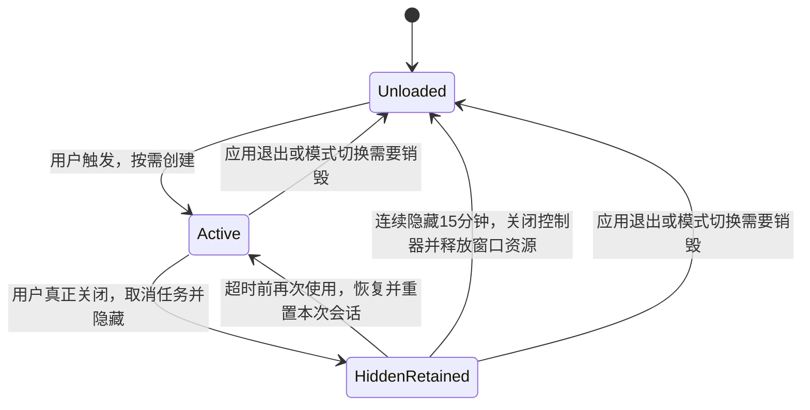

# 划词翻译窗口 WebView2 生命周期与内存优化方案

- 状态：**首轮实现、增量构建、相关契约、自查、A/B 测量及真实 15 分钟释放检查已完成；多屏与真实 IME 等人工验收仍待确认**
- 日期：2026-10-04
- 首轮范围：划词翻译（`SelectedText`）结果窗口的复用、挂起和闲置释放；包括同模式手工输入入口。
- 主要文件：`src/translation/TranslationResultWindow.cpp/.h`、`TranslationResultWindow.Lifecycle.cpp`、`src/translation/TranslationCoordinator.cpp`、`src/ocr/OcrMarkdownPreviewHost.cpp/.h`，以及直接相关的既有测试。
- 目标：保留现有复杂 HTML 表格、Mermaid、KaTeX、Markdown 编辑、独立缩放与原生回退能力，减少重复打开的初始化成本，并限定关闭后的资源保留时间。

## 0. 评审结论与实施边界

**推荐实施生命周期优化；先保留双 Host，不合并页面，不注入 Chromium 裁剪参数。**

采用“首次按需创建 → 用户关闭后隐藏保留 → 尝试挂起 → 连续隐藏 15 分钟后释放”的路线。15 分钟是首轮产品默认值，并非实测最优值；先使用常量，不扩展设置项。

本方案改善的是重复打开成本与关闭后的闲置占用。应用启动时不为本功能创建 WebView2；首次使用以及闲置释放后的再次使用，仍会经历按需初始化。若需进一步优化首次使用，必须根据分段测量另行定位，不宣称本轮可以消除冷启动。

原方案中的“0ms 秒开”“唤醒 2–5ms”“挂起固定约 15MB”“双 Host 内存减半”“所有子进程退出、全应用 0MB”均缺少本仓实测依据，删除这些保证。现有 500–800ms、150–250MB 仅作为待复核的现象描述，不作为已建立的基线。

完整保留既有能力是验收要求；只有通过对应测试与实机检查后，才能声明未发现功能回退，不能提前保证 IME 或多 DPI 行为绝对无缺陷。

## 1. 已核对的代码事实

下表定位以 2026-10-04 审阅时的代码为准；实施时按符号重新定位。

| 事实 | 代码位置 | 对实施的影响 |
| --- | --- | --- |
| 关闭按钮、`WM_CLOSE` 和非忙碌态 ESC 最终销毁 HWND | `TranslationResultWindow.cpp`：`HandleEscape`、`HandleMessage` | 需要统一用户关闭路径，区分隐藏和最终销毁 |
| `WM_DESTROY` 不析构 C++ 对象；`WM_NCDESTROY` 仅清空 `window_` | 同上：消息处理尾部 | 不能把“关闭 HWND”等同于“Host 显式释放完成” |
| 两个 Host 的 `Destroy()` 在窗口析构中执行 | 同上：`~TranslationResultWindow` | 必须保证闲置释放当时真正关闭控制器，不能等下次使用才释放 |
| Coordinator 已有同模式有效窗口复用 | `TranslationCoordinator.cpp`：`Start`、`StartTextEntry`、`StartText` | 扩展现有路径，不新建窗口池、缓存框架或 Environment 全局管理器 |
| 失效对象由 `CleanupInvalid` 清理，`Shutdown` 直接释放窗口 | 同上 | 保持最终释放与退出路径；防止回调中同步删除仍在执行的对象 |
| `Command::Close` 已推进工作流代际并取消网络/OCR、清理任务状态 | 同上：`OnWindowCommand` | 用户关闭后仍须取消任务；缓存 UI 不代表让任务后台继续 |
| `NotifyClose` 由 `closeNotified_` 去重 | `TranslationResultWindow.cpp/.h` | 新一轮显示必须重置通知状态，否则第二次关闭不会再次取消请求 |
| ESC 在忙碌态只取消任务；编辑态先取消编辑 | `HandleEscape`、`HandleChildKey`、预览快捷键回调 | 保留已有层级，不把所有 ESC 改为隐藏 |
| 两个 Host 使用相同 UDF，创建 Environment 时选项相同 | `OcrMarkdownPreviewHost.cpp`：`GetWebViewUserDataFolder`、`StartEnvironmentCreation` | 可能共享浏览器进程组，不能按 Host 数推算进程数或内存倍数 |
| `Show(false)` 已设置控制器 `IsVisible = FALSE` | 同上：`Impl::Show` | 复用现有隐藏接口，再增加显式挂起能力 |
| 预览可见性由 ready、metrics 和布局回调更新 | `UpdateSourcePreviewVisibility`、`UpdateTranslationPreviewVisibility` | 必须增加窗口生命周期门；迟到回调不能重新显示已隐藏的控制器 |
| 原文、译文已有独立缩放、选区、指标与回退状态 | 窗口成员与 `TranslationResultWindow.StructuredSelection.cpp` | 单页面合并会触及既有行为契约，不能当作机械替换 |
| 前端当前以单文档状态运作，OCR dashboard 共用同一资产 | `ocr-preview/preview.js`：`currentRenderToken`、编辑器、选区等 | 增加两个 div 不能完成安全合并；首轮保留资产结构 |

关闭后 Runtime 是否因父 HWND 销毁而退出、多久退出，需要测量；代码中没有“WM_DESTROY 立即析构并显式 Destroy 两个 Host”的链路。

反复创建是初始化成本的重要嫌疑，但并非已证明的唯一原因。当前 Host 在异步创建前还会验证资产；选区获取、结构化转换、页面渲染与网络阶段也要分别测量，避免把它们统称为 WebView2 冷启动。

## 2. 官方接口约束

1. 调用 `TrySuspend` 前，必须将 **CoreWebView2Controller 的 `IsVisible` 设为 false**；仅 `ShowWindow(SW_HIDE)` 不满足前提。
2. `TrySuspend` 是异步、尽力而为的操作。同步 HRESULT、完成 HRESULT 与 `isSuccessful` 都需处理；返回成功不代表页面脚本已立即停下。
3. 显示控制器会自动恢复。若需在显示前投递新内容，先调用 `Resume`，再更新、布局并按卡片可见性显示；某些 API 也会自动恢复，隐藏期间不要持续投递旧任务内容。
4. 挂起主要允许操作系统回收 renderer 使用的内存，不承诺固定内存值，也不代表私有提交量或 DOM/JS 数据已经释放。
5. 同配置、同 UDF 的多个 Environment 可以共享进程组；关闭一个控制器不意味着整个进程组退出。只有没有其他 WebView 使用浏览器实例时，才预期浏览器实例关闭。
6. Chromium/Edge 浏览器 flags 可能随 Runtime 改变，微软明确建议生产应用不依赖这类 flags。本方案不加入原提案中的进程限制、GPU 合成关闭、后台服务裁剪等参数。

来源：[TrySuspend / Resume](https://learn.microsoft.com/en-us/microsoft-edge/webview2/reference/win32/icorewebview2_3?view=webview2-1.0.3650.58)、[进程模型](https://learn.microsoft.com/en-us/microsoft-edge/webview2/concepts/process-model)、[Controller Close / IsVisible](https://learn.microsoft.com/en-us/microsoft-edge/webview2/reference/win32/icorewebview2controller)、[浏览器 flags 的生产限制](https://learn.microsoft.com/en-us/microsoft-edge/webview2/concepts/webview-features-flags)。

## 3. 生命周期与职责

### 3.1 最小状态模型

`HiddenRetained` 可包含正在挂起、已挂起或挂起失败；不要把“不可见”与“已挂起”合成同一个成功状态。两个 Host 分别记录请求结果；一个失败不妨碍另一个，也不妨碍驱逐。

首次异步创建也可能在隐藏时完成，需保存“期望隐藏/挂起”的状态；完成首次导航/ready 后再尝试挂起，避免后续初始化 Navigate 自动恢复。同步失败或异步失败时继续隐藏保留，到期释放，不进行无界重试。

生命周期由现有窗口管理 HWND、定时器和可见性；Coordinator 继续拥有窗口与翻译工作流；Host 负责自己的 COM 接口、异步回调安全与挂起结果。不得把业务任务转入 Host，也不得建立第二份窗口所有权。

### 3.2 用户关闭

首轮仅改变 `SelectedText` 窗口的真正关闭行为。截图 OCR 结果窗、dashboard、embedded 入口保持既有生命周期；共享 Host 的挂起接口只由本次窗口显式调用。模式切换沿用既有重建策略，不做跨模式缓存。

- 关闭按钮、`WM_CLOSE`、Ctrl+W、Alt+F4 与可关闭态 ESC 进入同一个关闭入口。
- 保持忙碌态 ESC 的取消语义、编辑态 ESC 的取消编辑语义。窗口外点击不新增自动关闭行为。
- 关闭仍执行既有 `Command::Close` 取消与代际隔离；保留的 UI 不再接受该工作流的完成结果。
- 清理编辑会话、未完成结构化选区、临时选区/工具栏与手势状态，停止 OCR/翻译计时及窗口 resize 动画。
- 未保存编辑遵循现有真正关闭的丢弃语义，不因 UI 缓存变为隐式保存或下次显示旧草稿。
- 隐藏两侧控制器与外层窗口，处理 AOT 边框/登记，随后尝试挂起并启动闲置计时。
- 异步编辑清理不可假设在挂起前立刻完成。下一轮内容准备必须再次重置状态，保证旧草稿与 IME 合成不会污染新内容；如确需前端消息，只增加必要的清理协议并验证。
- 一轮只通知关闭一次；最终销毁已关闭的缓存窗口不得再次触发工作流关闭。

隐藏期间，ready、metrics、布局、错误与保存回调不得重新显示 WebView、恢复计时、提交旧草稿或继续投递旧翻译。将可见性判定集中在现有可见性函数中，并覆盖首次显示前、隐藏、最小化等情况；不要在每个回调复制一份状态推导。

### 3.3 再次使用

- 先撤销驱逐定时器并使旧驱逐事件失效，再恢复两侧 Host。
- 重置 `closeNotified_`、busy、编辑、待保存、选区、计时与旧 metrics 状态；新原文与译文必须使用新的渲染 token。即使文本相同，也不能因现有相等短路留下旧编辑会话。
- 清空旧译文和旧错误提示；新结果准备好之前不闪现上一条翻译。
- 按最新设置同步 provider/model、语言、显示原文、置顶、边框及相关显示参数。
- 界面语言等创建时配置已变化、无法通过既有更新入口安全刷新时，直接沿既有路径销毁重建；不为保住缓存新增整套控件重载框架。
- **已显示窗口连续翻译**沿用现有位置保留行为；**已关闭后再次打开**按新选区锚点重新定位，不保留隐藏窗口的旧坐标。
- 展示前显式核对目标显示器 DPI，刷新字体、边界和自动尺寸。隐藏窗口不能只依赖 `WM_DPICHANGED`；覆盖跨屏、负坐标与任务栏工作区。
- Host 恢复或进程状态异常时使用既有原生回退；必要时按需重建失败 Host，不让失效控制器永久留在缓存中。

### 3.4 异步竞态与最终释放

必须覆盖“关闭 → 挂起未完成 → 再打开”以及“创建/挂起回调未完成 → 驱逐/退出”的序列。

- 延迟回调复用 Host 现有 `CallbackState` 生命周期保护，不捕获无保护的裸 `this`。
- 使用请求序号或等价失效机制区分新旧挂起请求；旧完成回调不得把当前活跃会话标记为已挂起。恢复与仍在途挂起的顺序必须实测验证，不能只改布尔值。
- 不能在 UI 线程同步等待挂起、JS 清理或浏览器进程退出。
- 驱逐只作用于仍隐藏、且截止时间已到的同一轮会话。撤销定时器后已排队的消息也必须无害。
- 闲置期从真正关闭时开始；隐藏回调不得刷新截止时间。到期同时释放两个 Host、原生窗口与相关资源，清理缓存文本。
- 到期必须实际执行 Host `Destroy()` / Controller `Close()`，不能只 `DestroyWindow` 后把重资源留到下一次 `CleanupInvalid`。
- 窗口由 Coordinator 的 `unique_ptr` 拥有；禁止在尚未返回的 WndProc/Host 回调里同步删除自身。可在窗口侧先释放重资源，再沿既有失效清理路径回收对象；若需 owner 延后回收，必须验证重入与退出顺序，不新建所有权框架。
- 应用退出无条件完成释放，不能退化为隐藏，也不等待 15 分钟。
- 控制器安全关闭后让 Runtime 自行退出；不按进程名结束 WebView2，不清空 UDF，不影响 dashboard 或其他应用。

15 分钟驱逐只适用于已关闭的缓存窗口。最小化保留当前任务和内容，恢复时恢复显示，不把仍在运行的任务当作闲置关闭来驱逐；两侧可见性需随最小化/恢复正确同步。

## 4. 首轮施工顺序与停止条件

### L0：建立基线

先使用当前代码，在唯一运行目录上测量，再修改生产源码。使用纯文本、跨行跨列表格、Mermaid/KaTeX 与长 Markdown 四组内容，固定显示原文、缩放和 provider/model 等条件。

分开记录：
- 触发至原生窗口可见；
- 资产验证、Environment/Controller 创建、页面 ready；
- 新原文/译文的对应渲染 token 首次有效 metrics 与实际显示；
- 外部选区获取、结构化转换及网络耗时。

记录进程 PID/类型、Runtime 版本、Working Set、Private Working Set 和 Private Bytes。统计 ZenCrop 关联的进程组，注明 dashboard 是否同时使用，不能把同名进程全部相加或把共享页简单当作独占占用。

冷启动至少 5 次独立样本、重复打开至少 30 次；分别测“应用本次首次使用”“仅关闭后重用”“到期释放后重建”。网络延迟不得混入 UI 复用收益；优先用既有 fake/loopback 测试固定结果内容。

证据进入 `build/artifacts/diagnostics/`。一次性脚手架交付前删除；可复用测量工具放 `scripts/`，不在 build 中保存手工脚本。

### L1：隐藏复用与真正释放

保留双 Host 与当前前端。统一关闭入口，扩展现有同模式复用，补齐会话重置、定位/DPI、可见性门、15 分钟驱逐与 Shutdown。

先证明取消、第二次关闭、旧结果隔离与到期释放正确，再接入挂起，避免同时改变页面结构和生命周期。

### L2：接入官方挂起并验证竞态

在 `OcrMarkdownPreviewHost.cpp/.h` 内提供必要的挂起/恢复操作与结果观察，沿用现有回调保护。两个 Host 分别调用；验证隐藏失败回退、异步创建后隐藏、挂起未完成即重开和退出。

挂起只减少闲置成本，不承担丢弃旧任务、保存编辑或清理所有资源的职责。

### L3：同条件 A/B 与交付

最终源码稳定后运行一次产品增量构建与直接相关门禁，完成下节自动化及可执行的实机检查，记录实际收益与未验证项。

**停止条件**：重复打开确实复用有效控制器；关闭取消与迟到结果隔离正确；隐藏尝试挂起、超时实际释放；相关门禁通过，且完成所列功能对照或明确保留实机待验项。达到这些条件即结束首轮，不自动进入单 Host 重构。

## 5. 验收与测量

### 5.1 自动化契约

扩展既有 `test_translation_contract` 与 `test_webview2_preview_contract`，不新增独立 test executable，不添加 test-only production API。

| 场景 | 必须证明 |
| --- | --- |
| 真正关闭、第二次打开、第二次关闭 | 窗口复用；每轮 Close 都取消任务，通知不遗漏 |
| 忙碌态/编辑态 ESC；关闭按钮/Ctrl+W/WM_CLOSE | 保持既有层级与统一关闭行为 |
| 未创建完成即关闭；挂起未完成即重开；退出 | 无悬空访问、重复控制器或晚到挂起污染 |
| 关闭后旧网络、错误、metrics、保存消息到达 | 不显示、不提交、不污染下一条翻译 |
| 预览可见性函数或布局在隐藏期间运行 | 两侧控制器仍不可见，不被自动恢复 |
| 重开前后与驱逐边界的旧 timer 消息 | 不销毁新活跃会话；到期真实释放两侧资源 |
| Shutdown、跨模式切换、Runtime 缺失/失败 | 释放安全、原生回退可用，OCR/dashboard 不退化 |

短时限验证通过既有计时入口/消息及可观察结果完成，使用“等待条件一致 + 时间上限”；必须验证过期与未到期，不能只人工发送一次 WM_TIMER 就认定 15 分钟逻辑正确。若现有入口不足，先寻找既有测试依赖注入，不暴露私有生产状态。

已有部分测试把“关闭”断言为 `!IsWindow` 或 `FindWindow == nullptr`，首轮需调整 **SelectedText 用户关闭**的预期为不可见、任务已取消，并另保留到期/Shutdown 的物理销毁断言。不能一律放宽为“消息成功投递”。窗口按本进程/本测试所有权识别，避免误取用户正在运行的窗口。

沿用既有网络关闭 UI 响应 **250ms 上限**。WebView2 不可用/环境不支持时，应明确报告跳过或未验证；原生回退通过不代表挂起、复杂渲染或编辑能力已验证。

### 5.2 实机功能与性能

| 项目 | 检查方式与判据 |
| --- | --- |
| 按需启动 | 单独启动 ZenCrop、未用任何预览时，本功能不创建 WebView2 |
| 重复打开收益 | 同内容 A/B 报告中位数/P95；热复用不重复创建 Environment/Controller 或导航整页 |
| 挂起收益 | 关闭后 1s/5s/30s 采样，并记录两侧挂起结果；Working Set 与提交量分别报告 |
| 闲置释放 | 真实等待一次 15 分钟；确认本窗口控制器释放。仅在无其他共享 WebView 时验证进程组最终退出 |
| 反复使用 | 至少 30 轮及更长压力序列，检查控制器/句柄/内存有无持续累积趋势 |
| 表格/公式/图表 | 对照 colspan/rowspan 的显示、单元格编辑保存、Mermaid、KaTeX 和长文档 |
| 独立卡片能力 | 两侧独立缩放/滚动/复制/选区，原文显隐、源码切换与流式译文 |
| 编辑与 IME | 未保存关闭、保存中关闭、合成中关闭再开；中文/日文候选框与焦点实测 |
| 多显示器 | 96/144/192 DPI、跨屏重开、负坐标、上/左任务栏、置顶边框与工作区 |
| 浮层回归 | 选区工具栏不遮挡、不抖动；保留迟滞、手势期冻结与自占位扣除规则 |
| 共用 Host | dashboard 活跃期间关闭/驱逐划词窗，dashboard 的编辑与渲染继续有效 |

不设置未经基线验证的绝对内存承诺。先交付 P50/P95、工作集/提交量和资源释放证据；若热复用收益不明显，依据分段时间继续定位，不能用“Resume 调用耗时”替代“新内容实际可见耗时”。若挂起占用仍高，报告实际值，不靠盲加 flags 或合并重构遮掩。

产品构建和测试仍走仓库脚本；开始构建前按绝对路径处理本仓运行实例。交付前执行 `git diff --check`。2026-10-04 静态评审之后，经用户授权执行首轮；实际完成情况见 §7，人工验收不因自动化通过而自动签收。

## 6. 延后评估的优化

### 单 Host 双卡片

仅在 L0–L3 之后仍有可复现的活跃内存瓶颈，且实验能证明第二 Host 的增量占用值得承担改造成本时再立项。

必须先设计：每侧 render token/编辑状态/metrics/选区路由、独立缩放与坐标语义、原生卡片控件/分隔条配合、错误回退、共用 dashboard 兼容及 CSP/消毒/虚拟主机安全契约。单控制器的 `ZoomFactor` 作用于整个页面，无法直接保持当前两侧独立缩放；CSS 替代也需要完整行为验证。

不承诺内存或 IPC 减半，不在本轮直接修改 `index.html` 和 `preview.js` 的页面结构。

### 首次打开的资源加载

如果基线显示资产验证或 JS 初始加载占主要成本，可另评估重复校验消除、按需加载大库或显示路径优化。必须保持资产可信校验、离线安装与既有复杂内容能力，不能直接去掉验证或静默禁用 Mermaid/KaTeX。

### Chromium 参数

原提案的批量裁剪参数不进入正式实现。局部诊断实验必须与默认 Runtime 对照，并在交付前撤销；不为本轮建立参数配置系统。

## 7. 首轮执行与自查结果（2026-10-04）

### 7.1 已落地行为

- 仅 `SelectedText` 的真正关闭改为隐藏保留；关闭仍推进 Coordinator 工作流代际并取消请求。忙碌态 ESC 继续只取消，编辑态 ESC 沿用既有处理。
- 关闭时清空原文、译文、计时、选区与编辑会话，生成新的渲染 token，分别隐藏和尝试挂起两个 Host。重开恢复 Host、重置本轮状态并按新锚点和目标 DPI 布局；仍显示的连续翻译保留既有位置策略。
- 连续关闭 15 分钟后显式 `Destroy()` 两个 Host、关闭控制器并销毁 HWND；保留的小 C++ 包装对象由 Coordinator 的既有失效清理或 Shutdown 回收。最终释放不再次通知已完成的关闭。
- 界面语言或服务商启用项/名称列表变化，以及 Host 创建或进程失败，会让关闭窗口放弃复用并沿既有路径重建。OCR 结果窗保持真正关闭，dashboard/embedded 未引入缓存策略。
- 共用 Host 增加官方 `Suspend` / `Resume` 及实际挂起状态查询，沿用 `CallbackState` 保护在途回调；挂起完成时重新核对最新恢复意图。页面资产、双 Host、独立缩放及 Runtime 参数保持既有结构。

### 7.2 构建与契约证据

产品增量构建通过，安装副本位于 `build/run/x64-release/`，运行载荷布局为 93 个文件。架构守卫通过，规则命中自检 **15/15**，没有抬高基线。

| 验证 | 结果与覆盖 |
| --- | --- |
| `test_translation_contract` 默认完整门 | 最终源码通过，45.879s；关闭取消的 250ms 上限、重复关闭、提前/旧 timer、迟到错误、语言变更、OCR 销毁、Coordinator 三轮新内容复用和 Shutdown 物理销毁 |
| `test_webview2_preview_contract` 默认门 | 通过，10.727s；实际挂起/恢复、30 次在途挂起与恢复竞态、创建期间挂起、挂起中销毁及共用 UDF 的活跃兄弟 Host 继续可用，加上既有默认预览契约 |
| A/B 测量入口 | 每版四组内容，每组 5 次独立创建加 30 次重开，共 140 样本；最终版 120 次重开均确认复用，140 样本全部确认卡片切换到预览 |
| 真实闲置释放 | 938.734s 的测量运行通过；实际关闭后 **900022.7634ms** 销毁，提前 timer 不驱逐，关闭通知仍为 1 次 |
| 资源释放 | 无 dashboard/其他共用窗口的隔离测试中，驱逐后 1s 与完全释放后 1s 的关联 WebView2 进程列表均为空 |
| 差异检查 | `git diff --check` 通过；未 stage、commit 或修改架构基线/版本号 |

诊断证据位于 `build/artifacts/diagnostics/`：

- `translation-window-lifecycle-baseline.json`：修改前基线。
- `translation-window-lifecycle-delivery.json`：最终源码的 140 样本与内存快照。
- `translation-window-lifecycle-after-final.json`：真实 15 分钟释放运行。之后的生产修正仅收紧失败 Host 复用与隐藏编辑入口，未改变驱逐实现；最终源码另跑完整契约与 140 样本。
- `translation-lifecycle-contract-final.xml`、`translation-lifecycle-preview-final.xml`、`translation-lifecycle-idle-final.xml`、`translation-lifecycle-measure-final.xml`：对应测试记录。

### 7.3 实测收益及口径

Runtime 为 **154.0.4258.53**。测量隔离了网络与外部选区获取，固定双卡片显示，交替末尾字符强制新渲染。这里的“预览可见”是**对应内容 metrics 到达、两侧原生回退控件隐藏而切换到预览**；它不是截图级首帧，也不证明 Mermaid/KaTeX 全部异步绘制完成。独立创建样本没有清 OS 磁盘缓存，不能称作整机完全冷启动。P50 取中间两值平均，P95 取最近秩。

| 内容，重开各 30 次 | 修改前 P50 / P95（ms） | 最终版 P50 / P95（ms） |
| --- | ---: | ---: |
| 普通文本 | 184.0 / 198.1 | 14.6 / 16.3 |
| colspan/rowspan 表格 | 196.4 / 211.0 | 14.5 / 19.4 |
| Mermaid + KaTeX | 199.3 / 216.5 | 14.6 / 21.1 |
| 12000 字符长文档 | 1289.4 / 1312.5 | 667.5 / 681.0 |

普通内容的重开指标降低约 92%；长文档降低约 48%，仍有明显渲染成本。最终版独立创建 P50 为 192.2 / 194.9 / 202.6 / 1290.4ms，首次创建仍有初始化成本，不能宣称本轮消除了冷启动。

**内存取舍必须明确：旧行为关闭后直接释放，1s 快照中关联进程列表为空；新行为为速度保留资源最多 15 分钟，关闭后内存高于旧行为。** 挂起仅带来有限下降，不能将本轮描述成关闭后内存比原方案更低。

| 内容，连续 30 次重开后 | 活跃 Working Set 合计（MiB） | 隐藏 1s Working Set 合计 | 隐藏 1s Private Working Set 合计 | 隐藏 1s Private Bytes 合计 |
| --- | ---: | ---: | ---: | ---: |
| 普通文本 | 475.9 | 468.2 | 185.8 | 245.8 |
| 表格 | 518.9 | 491.9 | 203.1 | 265.3 |
| Mermaid + KaTeX | 602.8 | 592.2 | 289.7 | 353.2 |
| 长文档 | 652.8 | 592.0 | 286.3 | 348.1 |

表中按本测试进程的 WebView2 后代 PID 统计，未汇总电脑上其他应用的同名进程；每组隐藏快照为 7 个进程，无 dashboard。Working Set 合计包含共享页，不能等同于独占物理内存；Private Bytes 是提交量。基线未记录 Private Working Set，不做其 A/B 降幅声明。本机没有用内存压力强迫系统回收；现有结果不支持“挂起约 15MB”，也不支持“内存减半”。15 分钟只已证明是正确工作的保留上限，尚未证明是最优产品参数。

### 7.4 自查修正与保留事项

自查覆盖控制器回调生命期、关闭回调可能销毁 owner、隐藏可见性、render token/工作流代际、计时失效、最新设置、锚点/DPI 与最终释放。发现并处理：

1. Host 同步创建失败并被清空后，不能把空 Host 判作可复用；现改为下次启动重建，并在未初始化 COM 的独立线程强制该失败路径验证。
2. 隐藏期间迟到的编辑入口必须被拒绝，避免启动旧编辑会话；保存/metrics/editor state 已有隐藏门与 token 保护。
3. 关闭丢弃待定结构化选区时，先撤销客户回调，避免在 teardown 中重入 owner；Close 通知放在全部清理的最后。
4. 新增 TU 不能增加 `Strings.h` 直接依赖计数；将需要语言判断的复用检查保留在既有 TU，架构基线维持 39。

测试夹具同时修正真实预览创建的 OCR 映射目录，使用测试输出根下 PID 隔离目录；原有布局断言只检查宿主拥有的直接子窗口，避免把 Chromium 被祖先裁剪的大 D3D 分配面误判为本窗控件越界。Source 模式显隐测试按既有“保持用户所选模式”契约断言，未修改产品切换行为。

仍待人工或专门测量：真实中文/日文 IME 合成、保存中关闭与再开，多屏混合 DPI/负坐标/任务栏边/置顶边框，真实 dashboard 活跃时的交互，完整视觉表格/公式/图表对照，以及更长压力序列中的句柄和内存趋势。此次内存只有活跃与隐藏 1s 快照，未完成 5s/30s 时间序列；未逐段测资产校验、Environment、Controller、页面 ready 或浏览器进程类型。现有自动化和 30 次循环不能替代这些验收，也不能据此宣称无泄漏或全 UI 已签收。

### 7.5 用户回归：退出后置顶未生效

用户报告已勾选置顶、退出重进后没有实际置顶。本机设置中的 `translation.resultOnTop` 仍为 `true`，保存和读取未丢失；回归测试重建窗口时，AOT Manager 记录为已 pin，但 HWND 的 `WS_EX_TOPMOST` 未置位。最小原生窗口探针同样复现，单纯显示后重发调用无效；添加 `SWP_NOOWNERZORDER` 后实际属性生效。

修复落在共用 `AlwaysOnTopManager::PinWindow` 的 `SetWindowPos`：保持 owner 的 Z order 不变，避免恢复置顶时 owner/owned-window 层级联动干扰。没有增加窗口侧的重复 pin 调用或改写用户设置。既有 `TestRetainedCoordinatorReuse` 扩展验证点击 pin、三轮关闭重开、Shutdown 后新建 Coordinator/窗口恢复已存偏好，以及取消置顶后保存与实际属性一致。

最终产品增量构建与架构自检 15/15 通过；完整 `test_translation_contract` 通过（45.92s），证据为 `build/artifacts/diagnostics/translation-pin-persistence-full.xml`。一次完整门曾在既有固定 400ms 的高度增长检查（593）失败；添加失败几何诊断后重跑通过，未修改该布局实现或放宽断言。该记录不将新建 Coordinator 等同于全部真实进程/多屏人工验收。

### 7.6 全工作区自查与审查交接（2026-10-04）

按用户要求，自查当前工作区全部差异，包括普通 `git diff` 不显示的两个新增文件 `src/translation/TranslationResultWindow.Lifecycle.cpp` 与 `tests/TranslationWindowLifecycleContract.cpp`。覆盖构建登记、Host 异步回调/最终释放、窗口隐藏/恢复/驱逐、Coordinator 会话代际、结构化选区取消、共用置顶管理、默认测试与测量入口；本轮没有发现新的确定生产缺陷，没有借此扩展生产实现。

发现并补齐测试漏检：

1. `IsWindowVisible(nullptr)` 为假，缺失控件或失效 HWND 原先可能被测量入口当成“原生回退已隐藏、预览已可见”。现要求宿主存在、可见且未最小化，两侧原生回退控件均存在后再判断隐藏；默认门补无效 HWND 反例。
2. 进程快照与内存读取失败原先会静默返回空列表或遗漏 PID，可能被当成“资源已释放”。现输出 `memory_errors` 并令测量失败；一次采集错误不再支撑零进程结论。
3. 闲置释放原先只记录耗时，没有断言不得提前驱逐。现以生产 deadline 所用的 `GetTickCount64` 检查 900000ms 下限，并保留 `steady_clock` 精确耗时；使用同一时钟避免精度差造成误报。
4. 30 轮挂起/恢复原先连续发送后只检查页面脚本，多个序列可能共用同一在途挂起请求，且脚本自身可能唤醒 WebView。现每轮派发完成回调后先检查原生 `IsSuspended`，最终再检查页面可见且 ready 次数未增加；这仍是本机有界竞态检查，不代表穷尽全部回调延迟。

复核证据位于 `build/artifacts/diagnostics/`：`translation-workspace-review-contract.xml` 为完整翻译门（最终测试源码通过，45.33s），`translation-workspace-review-measure.xml` 与 `translation-window-lifecycle-review.json` 为补强可见性/内存失败判据后的 140 样本（36.88s），`translation-workspace-review-preview.xml` 为预览默认门。测量 140/140 确认可见，120/120 次重开确认复用，`memory_errors` 为空，完全释放后关联进程列表为空；预览门通过（14.06s）。本轮未重新等待 15 分钟，§7.2 的既有实测 **900022.7634ms** 满足新增下限；最终测试源码已编译。

一次预览门在既有资产夹具的 case-variant 目录改名步骤失败，尚未进入挂起检查；添加具体改名步骤/错误码诊断后重跑通过，未改变该夹具的失败判据。初次失败没有错误码，原因未确定，保留 `translation-workspace-review-preview-fixture-failure.xml`，不能据此断言问题已根治。§7.5 的固定时长布局检查同样保持既有风险记录。

`doc/CHANGELOG.md` 新增 **Unreleased (2026-10-04)** 条目，记录行为、置顶根因、实测口径和内存取舍及人工验收缺口；产品版本维持 3.1.9。交接审查应同时检查已跟踪差异和上述两个未跟踪文件；不要只审阅普通 `git diff`。工作区不 stage、不 commit、不 push。
