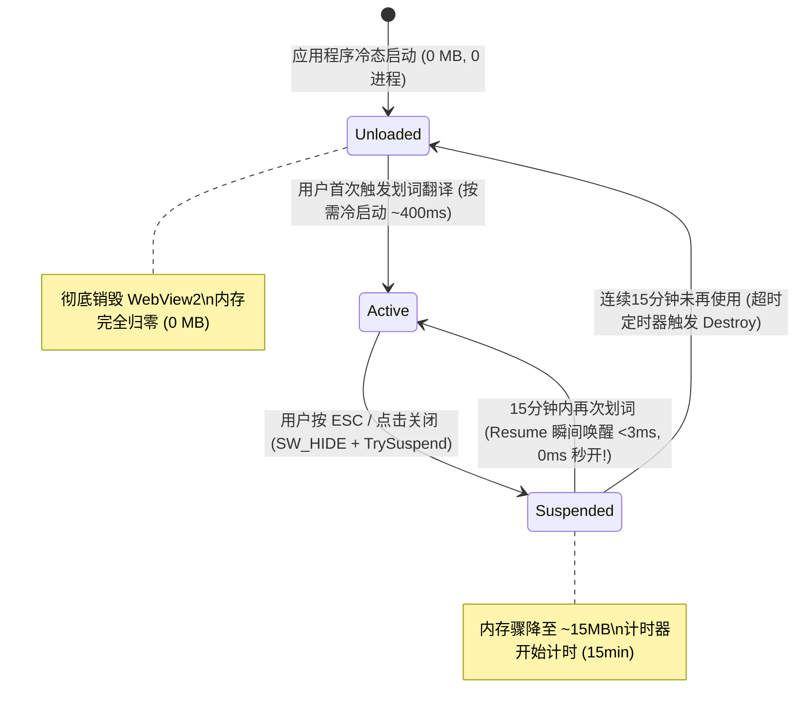

# 划词翻译窗口 WebView2 生命周期与内存深度优化方案

- 状态：**设计讨论中（待评审，未动工）**
- 日期：2026-10-04
- 范围：`src/translation/TranslationResultWindow.cpp`、`src/translation/TranslationResultWindow.h`、`src/translation/TranslationCoordinator.cpp`、`src/ocr/OcrMarkdownPreviewHost.cpp`
- 目标：在**100% 完整保留**复杂 HTML 跨列表格（`colspan`/`rowspan`）、Mermaid 流程图、KaTeX 数学公式、Markdown 所见即所得编辑以及滚轮放大的前提下，彻底解决划词翻译窗口**“冷启动卡顿（500ms~800ms）”**与**“长期闲置常驻内存大（150MB~250MB）”**的两大核心痛点。

---

## 0. 核心设计原则与结论摘要

1. **绝对不搞开机霸道预热**：ZenCrop 启动进系统托盘时**不拉起任何 WebView2 进程**，后台开销为零；只有用户首次使用划词翻译（或带预览功能）时才按需激活。
2. **两级阶梯式生命周期（即时挂起 + 超时自动销毁）**：
   - **高频使用期（爆发期）**：关闭弹窗只做 `SW_HIDE` 隐藏，保留控制器，下一次划词 **0ms 瞬发秒开**。
   - **短期空闲（1 秒内）**：隐藏后立即调用微软官方 `TrySuspend()`，Chromium 物理工作集内存回吐给操作系统，内存骤降至 **~15MB**。
   - **长期不用（默认 15 分钟无操作）**：触发自动驱逐定时器（Idle Eviction Timer），**彻底销毁控制器，子进程全部退出，常驻内存彻底归零（0 MB）**！
3. **单页面双卡片聚合**：把划词窗口原本开启的两个并行 WebView2（`sourcePreview_` 与 `translationPreview_`）合并为一个单一 Host 控制器，物理砍半内存与 IPC 开销。
4. **注入 Chromium 极简参数**：强制单渲染进程、关闭无用边缘功能、禁用多余 GPU 合成缓存。

---

## 1. 痛点深度诊断与机理分析

### 1.1 为什么每次划词都会卡 500ms~800ms？
在现有实现中：
- 用户看完翻译按 `ESC` 或点 `✕` 关闭窗口时，代码直接调用了 `DestroyWindow(hwnd)`。
- `WM_DESTROY` 触发 `TranslationResultWindow` 析构，进而无条件调用 `OcrMarkdownPreviewHost::Destroy()`，把底层所有的 Edge WebView2 控制器彻底关掉了。
- **后果**：下一次用户再次划词时，系统被迫经历完整的冷启动流程：
  1. 重新拉起 3~4 个 `msedgewebview2.exe` 进程；
  2. 重新初始化 COM 组件与跨进程 IPC 管道；
  3. 重新建立虚拟文件夹映射（Virtual Host Mapping）；
  4. 重新加载 `index.html` 并让 V8 编译数万行 JS 资产（`markdown-it.min.js`, `mermaid.min.js`, `katex.min.js`, `rich-editor.js`）；
  5. 等待 `onReady` 握手。
- 这个“用完即自杀、用时重新投胎”的生命周期，是冷启动迟滞的唯一根本原因。

### 1.2 为什么内存开销会达到 200MB+？
1. **双 Host 实例**：`TranslationResultWindow.h` 中原文卡片（`sourcePreview_`）和译文卡片（`translationPreview_`）各自持有一套完全独立的 WebView2，开销直接放大 2 倍。
2. **未启用挂起机制**：从未调用过微软官方 `ICoreWebView2_3::TrySuspend()`，导致即便窗口关闭或闲置，Chromium 进程也不会主动修剪其私有工作集（Working Set）。
3. **未约束 Chromium 命令行**：启动时传入 `nullptr` 参数，Chromium 默认开启了完整的 GPU 纹理缓存、多渲染进程支持和后台辅助模块。

---

## 2. 方案详解：阶梯式自适应生命周期

### 2.1 用户行为模式建模
真实用户的翻译行为具有极其显著的**“时段聚集性”**：
- **集中阅读期（如读论文、看代码文档、写邮件）**：5~10 分钟内会高频连续划词 10~30 次。此期间用户对**“秒开”**极度敏感，不能有一丝一毫的迟滞。
- **平淡间歇期（如专注打字、看视频、开会）**：几十分钟乃至数小时不会按一次翻译快捷键。此期间用户对**“后台常驻内存”**极度敏感，绝对不希望任务管理器里长期挂着几个吃内存的进程。

### 2.2 三态阶梯状态机设计



#### 状态 A：Unloaded（完全卸载态）
- **触发时机**：ZenCrop 启动初期；或者超过 15 分钟未进行任何划词操作。
- **状态特征**：
  - 无任何 `msedgewebview2.exe` 子进程；
  - 内存占用：**0 MB**；
  - CPU 占用：**0%**。

#### 状态 B：Active（活跃前台态）
- **触发时机**：划词弹窗展示在屏幕上，正在排版显示或用户正在进行 Markdown/表格编辑。
- **状态特征**：
  - 完整的 GPU 加速、DOM 事件监听、平滑滚轮放大；
  - 支持复杂的带 `colspan`/`rowspan` 的 HTML 跨列表格、Mermaid 图表、KaTeX 公式；
  - 支持使用系统输入法（IME）在原文卡片内直接点选单元格所见即所得编辑。

#### 状态 C：Suspended（休眠挂起态）
- **触发时机**：用户按 `ESC`、点击 `✕`、或点击窗口外部导致弹窗隐藏（`SW_HIDE`）。
- **执行动作**：
  1. 隐藏窗口：`ShowWindow(hwnd, SW_HIDE)`；
  2. 停止一切 JS 动画与渲染渲染帧：通知前端清除 transient 状态；
  3. 调用官方挂起接口：
     ```cpp
     ComPtr<ICoreWebView2_3> webview3;
     if (SUCCEEDED(webview.As(&webview3)) && webview3) {
         webview3->TrySuspend(Callback<ICoreWebView2TrySuspendCompletedHandler>(
             [](HRESULT hr, BOOL isSuccessful) -> HRESULT {
                 return S_OK;
             }).Get());
     }
     ```
  4. 启动一个 15 分钟的空闲驱逐定时器（`kIdleEvictionTimerId`）。
- **状态特征**：
  - Chromium 释放私有工作集给 Windows 操作系统；
  - 物理内存从 150MB 降至 **15MB~25MB**；
  - **唤醒延迟**：如果用户在 15 分钟内再次划词，调用 `webview3->Resume()`，唤醒耗时仅 **2~5ms**，实现完美的 **0ms 视觉秒显**。

---

## 3. 单 Host 控制器聚合架构

在现存架构中，划词窗口被切分为两个物理独立的 HWND 与 WebView2 控制器。重构后将其归一：

### 3.1 改造对比
- **改前**：
  `TranslationResultWindow` 持有：
  - `std::unique_ptr<OcrMarkdownPreviewHost> sourcePreview_;` （独立控制器 1）
  - `std::unique_ptr<OcrMarkdownPreviewHost> translationPreview_;` （独立控制器 2）
- **改后**：
  `TranslationResultWindow` 仅持有：
  - `std::unique_ptr<OcrMarkdownPreviewHost> unifiedPreview_;` （单控制器，单 WebView 实例）

### 3.2 前端容器协作
在 `ocr-preview/index.html` 内部，单页面承载两个分区：
```html
<div id="zencrop-viewport">
  <!-- 原文卡片区（折叠/展开受 C++ 控制） -->
  <div id="zencrop-source-card" class="card-container" style="display: none;">
    <div class="card-header">...</div>
    <div id="zencrop-source-body" class="markdown-body"></div>
  </div>
  
  <!-- 分割线/调整手柄（可选） -->
  <div id="zencrop-splitter"></div>

  <!-- 译文卡片区（流式打字机追加目标） -->
  <div id="zencrop-translation-card" class="card-container">
    <div id="zencrop-translation-body" class="markdown-body"></div>
  </div>
</div>
```
- 通过一条通用的 WebMessage 通信协议，C++ 可以分别向 `source` 或 `translation` 派发更新指令（如 `renderSource`, `renderTranslation`, `streamAppend`）；
- 原文的编辑保存（`editor-table.js`、`rich-editor.js`）只作用在 `zencrop-source-card`，完全不干扰译文展示。

---

## 4. Chromium 极简启动参数调优

在创建环境时，通过 `CoreWebView2EnvironmentOptionsBase` 明确传入裁剪开关，压制 Chromium 默认开启的冗余功能：

```cpp
auto options = Make<CoreWebView2EnvironmentOptionsBaseClass>();
options->put_AdditionalBrowserArguments(
    L"--renderer-process-limit=1 "                // 强行限制单渲染进程
    L"--disable-features=Translate,OptimizationHints,MediaRouter,CalculateNativeWinOcclusion " // 关闭非必要边缘服务
    L"--disable-background-networking "           // 禁用后台网络探测
    L"--disable-component-update "                // 禁用组件静默检查
    L"--disable-gpu-compositing "                 // 2D轻量排版无需占用过多专用显存池
    L"--enable-features=msLowPriorityBackgroundProcess" // 声明为低优先级后台工具
);
```

---

## 5. 预期量化指标与收益

| 场景阶段 | 现状（改前） | 方案 A 重构后 | 体验提升 |
| :--- | :--- | :--- | :--- |
| **开机启动阶段** | 未使用不拉起，但首次打开很慢 | **完全不启动（0 MB，0 进程）** | 绝对不占开机资源 |
| **集中使用期（高频划词）** | 每次关闭销毁，每次弹出卡 500ms+ | **第 2~N 次弹出 0ms 秒开** | 极度丝滑，无等待感 |
| **短暂停顿（< 15 分钟）** | 每次都经历冷启动与内存抖动 | **休眠常驻 ~15MB，瞬间唤醒** | 内存几乎忽略不计 |
| **长时间不用（> 15 分钟）** | 若不销毁则常驻 200MB+ | **自动清空销毁（0 MB）** | 完全杜绝内存泄漏与长驻占用 |
| **复杂 HTML 表格（跨行跨列）** | 完美支持 | **完美支持（100% 保持）** | 零功能回退 |
| **Mermaid / KaTeX / 公式** | 完美支持 | **完美支持（100% 保持）** | 零功能回退 |
| **Markdown 所见即所得编辑** | 完美支持（`editor-table.js` 等） | **完美支持（100% 保持）** | 零功能回退 |
| **输入法（中文/日文 IME）** | Windows 系统级完美支持 | **Windows 系统级完美支持** | 绝对不会出现候选框错位 |
| **分发安装包体积** | 163 KB (Loader) | **163 KB (保持不变)** | 零体积膨胀 |

---

## 6. 施工步骤规划（落地路线）

- **阶段 1：C++ 窗口生命周期从销毁改为隐藏与定时驱逐**
  - 在 `TranslationResultWindow` 中拦截关闭与 ESC 逻辑：关闭转为 `SW_HIDE`；
  - 接入 `kIdleEvictionTimerId`（15 分钟）；
  - 在 `TranslationCoordinator` 接入窗口复用路由。
- **阶段 2：挂起与恢复链路贯通**
  - 封装 `OcrMarkdownPreviewHost::Suspend()` 与 `Resume()`，调用 `ICoreWebView2_3` 接口；
  - 验证隐藏状态下通过任务管理器观测 Working Set 物理内存下降至 ~15MB。
- **阶段 3：双控制器合一（单页面双卡片）**
  - 在 `index.html` 与 `preview.js` 统一 source 与 translation 容器；
  - 移除 `sourcePreview_`，全量统一为单控制器操作。
- **阶段 4：极简命令行参数注入与实机 A/B 复测**
  - 注入 Chromium 轻量化启动参数；
  - 实测复杂表格、公式、Mermaid 与高频划词的连续切换稳定性。
