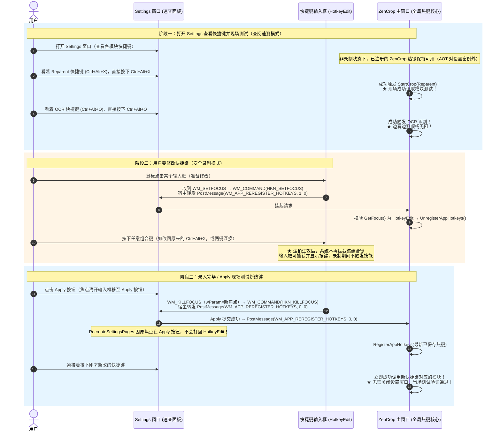

# 设置界面快捷键焦点感知挂起与现场即时测试方案审查报告

- **状态**：代码实施完成，架构守卫与契约测试通过；**TC-01…TC-07 实机 UI 走查完成前不得签收**（Implemented, Pending On-Device UI Verification）。版本源已升至 v3.1.2，尚未打包。
- **日期**：2026-09-25
- **修订记录**：
  - 2026-09-25 吸收独立审查人意见，修正 A（wParam=1 幂等自洽）、B（拓扑路由消除脆弱假设）、C（防抖归因与抢占模式修正）、D（AOT 排除设置窗类名与语义冲突定义）、E（主窗禁用下技能弹出实机验证风险）、F（时序与 RecreateSettingsPages 焦点不变性补充）、G（标明真实改动范围）、H/I（守卫定位与 PostMessage 异步取舍）。
  - 2026-09-25 第二轮复核落地四项：(1) **移除** `WM_APP_REREGISTER_HOTKEYS` 中的 `AlwaysOnTopManager::UpdateSettings()`——该消息现在每次焦点进出都会触发，而 `UpdateSettings()` 会读设置文件并重排全部置顶边框，属真实的每次交互 I/O；(2) `WM_KILLFOCUS` 改用文档化的 `wParam`（新焦点窗口，可为 NULL）判定，不再依赖 `GetFocus()` 在本消息内的未定义时序；(3) 模态循环复用已取到的 `className`，去掉重复类名查询；(4) `kSettingsWindowClassName` 归位到 `src/ocr/ui/SettingsDialog.h`（L4 公共头，main.cpp 已合法 include），删除 `AppMessages.h` 内的该类名常量与 `SettingsDialogInternal.h` 的 `using` 兼容别名。
  - 2026-09-25 新增自动化回归：`test_translation_contract` 内补 `HotkeyEdit → 宿主` 焦点通知与输入框间切换防抖用例（见 §6）。
- **对象**：
  - 全局热键生命周期与分发调度（`src/main.cpp`）
  - 设置窗口宿主与提交路由（`src/ocr/ui/SettingsDialog.cpp`）
  - 自定义快捷键录入控件（`src/core/HotkeyEdit.cpp`）
  - 进程级自定义消息（`src/core/AppMessages.h`）
- **核心目标**：
  1. **速查与现场测试**：用户打开 Settings 窗口查看各个模块的快捷键，**直接按下快捷键即可现场成功调用对应的各个模块**（截图、OCR、裁切、划词翻译等）；
  2. **自由改键与防死锁**：**只有当用户点击某个快捷键输入框录制修改时，才临时挂起系统全局热键**，彻底解决“改了之后未 Apply 无法改回原键”、“两键互换被拦截”和“录入时误触发技能”问题；
  3. **改后现场验证**：录入完毕或点击 Apply 后，热键立即自动恢复/刷新，用户在当前设置界面下**立刻就能按下新改的快捷键现场测试验证模块调用**。

---

## 1. 覆盖范围与核心问题

### 1.1 全仓快捷键与设置页面完整覆盖表（全量 9 大热键）
本方案**覆盖 ZenCrop 全仓全部 5 个设置页面的所有 9 个全局热键**，并非仅针对 ZenCrop 页的 Reparent。底层由统一的系统全局热键调度体系（`RegisterAppHotkeys` / `UnregisterAppHotkeys`）统一管理：

| 页面（Tab） | 快捷键配置项（Setting） | 控件 ID | 全局热键 ID | 对应触发的技能（Skill Invocation） |
| :--- | :--- | :--- | :---: | :--- |
| **ZenCrop 页** | **Reparent**（嵌入置顶） | `IDC_HK_REPARENT_EDIT` | 1 | `StartCrop(CropMode::Reparent)` 裁切嵌入浮层 |
| **ZenCrop 页** | **Thumbnail**（缩略图） | `IDC_HK_THUMBNAIL_EDIT` | 2 | `StartCrop(CropMode::Thumbnail)` 缩略图浮层 |
| **ZenCrop 页** | **Close All**（关闭置顶） | `IDC_HK_CLOSE_EDIT` | 3 | 清空所有 Reparent/Viewport 置顶窗口 |
| **Always On Top 页** | **Always On Top**（切换置顶） | `IDC_HK_AOT_EDIT` | 4 | `AlwaysOnTopManager::TogglePin(target)` 切换窗口置顶 |
| **ZenCrop 页** | **Viewport**（视口置顶） | `IDC_HK_VIEWPORT_EDIT` | 5 | `StartCrop(CropMode::Viewport)` 视口裁切浮层 |
| **Screenshot 页** | **Screenshot**（交互式截屏） | `IDC_HK_SCREENSHOT_EDIT` | 6 | `ScreenshotSession::StartInteractive()` 全屏截图遮罩 |
| **OCR 页** | **OCR**（主识别快捷键） | `IDC_HK_OCR_EDIT` | 7 | `StartCrop(CropMode::Ocr)` OCR 裁切与识别流程 |
| **OCR 页** | **Alt OCR**（备用识别快捷键） | `IDC_HK_OCR_ALT_EDIT` | 8 | `StartAltOcrCrop()` 备用引擎 OCR 流程 |
| **Translate 页** | **Translate**（划词翻译） | `IDC_TRANSLATE_SELECTION_HOTKEY_EDIT` | 9 | `SelectionTranslationController::Start()` 选区捕获与翻译 |

### 1.2 问题现象与底层根因
1. **输入死锁**：用户在任何页面将某个快捷键（如 Reparent）改为其他键后，在未点击 Apply 的情况下，若想改回原快捷键（如 `Ctrl + Alt + X`），输入框毫无反应，无法录入；两项快捷键互换时（如将 Translate 与 OCR 的键对调）也无法录入对方当前占用的按键。
2. **技能误触发**：在输入框按下已被注册的热键瞬间，屏幕上立刻弹出了该快捷键绑定的功能（如裁切置顶浮层、截图遮罩层、OCR 进度条、划词翻译框等“技能调用”），打断了设置流程。
3. **底层根因**：Windows 的 `RegisterHotKey` 具有最高优先级的系统级拦截权。只要某个快捷键处于注册状态，用户按下该组合键时，系统就会**直接吞噬该击键**并向主线程发送 `WM_HOTKEY`，**绝对不会向当前拥有键盘焦点的输入控件（`HotkeyEdit`）派发 `WM_KEYDOWN` 或 `WM_SYSKEYDOWN`**。
4. **单纯禁用技能调用不可行**：若仅在 `WM_HOTKEY` 中拦截不调用技能，系统击键依然会被 Windows 内核吞掉，输入框依然收不到按键，无法改回原快捷键。**唯一的根本解法是在用户聚焦输入框录制期间，在系统层注销全局热键（`UnregisterHotKey` 1~9）**。

---

## 2. 目标方案：输入框焦点感知挂起方案（Focus-Aware Hotkey Suspension）

### 2.1 方案核心思想
- **模式 1：查阅速测模式（默认状态）**
  - 用户打开 Settings 窗口查看各个模块对应的快捷键；
  - **非录制状态下，已成功注册的 ZenCrop 热键保持可用**（`RegisterHotKey` 失败的键本就不生效）；
  - 用户对照着界面按下对应快捷键，即可在设置窗口内调取对应模块（截图、OCR、裁切、划词翻译等），无需关闭窗口、无需切换前台后台。**Always On Top 是刻意例外**——设置窗口处于前台时它忽略设置窗自身（见 §3.3）。注：焦点通知经 `PostMessage` 异步投递，注销被处理前的一瞬按下的按键仍可能被系统吞掉，故本模式待实机验证。
- **模式 2：安全录制模式（焦点捕获状态）**
  - **只有当用户的光标点击进入某个快捷键输入框（准备修改快捷键）时**，输入框收到 `WM_SETFOCUS`，应用全局热键才临时挂起（注销）；
  - 注销生效后输入框拥有纯净按键环境，可录入组合键（**包括原本的快捷键、其他功能的快捷键、以及当前绑定给其他动作的键**），不被系统拦截，录制期间不触发任何技能；
- **模式 3：即时生效与恢复模式（录完 / Apply 状态）**
  - 用户录制完成后，点击输入框外部、切换到其他控件、或点击 `Apply` 按钮；
  - 输入框失去焦点（`WM_KILLFOCUS`），系统立即重新注册最新生效的全局热键；
  - 若用户点击了 `Apply`，新快捷键写入配置并立即生效，用户**无需关闭设置窗口，当场直接按下新改的快捷键即可立刻测试新功能**！

### 2.2 完整操作时序图



> 上述时序是**目标设计流程，尚未实机验证**：焦点通知经 `PostMessage` 异步投递，注销生效前的一瞬按下的按键仍可能被系统吞掉；Always On Top 在设置窗前台属刻意忽略。逐条结果以 §5 的 TC-01…TC-07 实机走查为准。

---

## 3. 关键审查意见吸纳与深度技术保障

### 3.1 焦点通知走标准控件协议并经宿主转发（吸纳意见 B）
- 控件层既不直呼主窗口，也不做多层 HWND 拓扑推导：`HotkeyEdit`（L0）在焦点进出时向其**宿主设置窗口**（`edit -> page -> sheet` 两层父级，沿用既有 `NotifyHotkeyChanged` 的路由契约）发送标准 `WM_COMMAND`，携带专有通知码 `HKN_SETFOCUS` / `HKN_KILLFOCUS`（定义在 `src/core/HotkeyEdit.h`，占用 0x0801/0x0802 私有区间，**不借用** EDIT 控件的 `EN_SETFOCUS`/`EN_KILLFOCUS`）。
- 宿主 `SettingsWindowProc` 的 `WM_COMMAND` 再把 `WM_APP_REREGISTER_HOTKEYS(1/0)` 投递给主窗口。L0 控件出边保持为 0，主窗口无需被控件直接寻址。

### 3.2 主窗口挂起处理具备“自证自愈”幂等性（吸纳意见 A）
- 当主窗口收到 `WM_APP_REREGISTER_HOTKEYS` 且 `wParam == 1`（请求挂起）时，**不进行盲目注销**，而是主动检查当前键盘焦点：
  ```cpp
  HWND focus = GetFocus();
  if (IsHotkeyEditWindow(focus)) {   // kHotkeyEditClassName，见 HotkeyEdit.h
      UnregisterAppHotkeys(hwnd);
  }
  ```
  焦点已离开 `HotkeyEdit`（或为 NULL，即线程未持焦）时主窗口拒绝注销，保证系统热键绝不出现“永久孤儿挂起”。
  当 `wParam == 0`（请求恢复）时，无条件执行 `UnregisterAppHotkeys(hwnd) + RegisterAppHotkeys(hwnd)`，达到强一致状态。
- **不在此调用 `AlwaysOnTopManager::UpdateSettings()`**：该消息现在每次焦点进出都会触发，而 `UpdateSettings()` 会读取设置文件并重排全部置顶边框；Apply 与关闭设置路径已在真正改写设置后各自刷新（见 §4.3）。

### 3.3 既有语义冲突明确与 AOT 排除名单加固（吸纳意见 D）
在设置窗口处于前台时直接按快捷键测试，存在两处既有语义冲突，本方案予以明确处理：
1. **Always On Top（ID 4）**：
   - 现状：`src/main.cpp:564` 以 `GetForegroundWindow()` 为目标，排除名单（`:577-580`）仅有 `ZenCrop.Main`、`ZenCrop.Overlay`、`ZenCrop.AlwaysOnTopBorder`，**未排除设置窗口自身**（`ZenCropSettingsWindowClass`）；
   - 处理：在 `main.cpp:580` 明确将 `ZenCropSettingsWindowClass`（常量 `kSettingsWindowClassName`，见 `src/ocr/ui/SettingsDialog.h`）纳入排除！当设置窗口处于前台时，按 AOT 快捷键**静默忽略对设置窗口自身的置顶**，避免将设置窗口套上置顶红框；用户若要测试 AOT，需将鼠标激活至目标应用窗口。
2. **Close All（ID 3）**：
   - 语义确认：Close All 快捷键是全局清空所有置顶窗口，在设置窗口前台按下时，**正常执行清空置顶窗口的既有语义**。

### 3.4 连续切换防抖与外部占用恢复失败处理（吸纳意见 C）
- **防抖机制**：`WM_KILLFOCUS` 时用**文档化的 `wParam`**（即将获得焦点的窗口，可为 NULL）判定：若新焦点仍是 HotkeyEdit（`IsHotkeyEditWindow`），跳过 resume 通知，避免在两个输入框之间来回切换时高频打 `RegisterHotKey`/`UnregisterHotKey`。之所以不用 `GetFocus()`：它在本消息内返回什么并非文档化行为，若返回旧窗口（即本控件）会被误判为“仍在输入框”，从而跳过恢复通知、使热键滞留挂起态。
- **外部抢占恢复处理（如实记录，未修复）**：若在临时挂起期间某快捷键被外部第三方程序抢占，恢复注册会失败；`RegisterOneHotkey` 只输出 Debug 日志（`main.cpp:474`），**当前没有用户可见反馈**。`ApplySettings` 的冲突检查是 `SettingsDialog.cpp:307` 的 `HasHotkeyConflict`，它只覆盖 **ZenCrop 配置项之间**的冲突，**不覆盖外部进程占用**，因此不能声称由它接管。该缺口不在本次修复范围内。

### 3.5 技能弹出与实机验证风险声明（吸纳意见 E）
- 宿主在 `SettingsDialog.cpp:829` 对主窗口 `EnableWindow(parent, FALSE)`。 ZenCrop 的技能窗口（`OverlayWindow.cpp:337`、`ReparentWindow.cpp:138`、`ScreenshotEditorWindow.cpp:83`）均以 `owner=nullptr` 创建，独立于被禁用的主窗口，可以正常拉起。
- **风险与验证项**：在“主窗禁用 + 设置窗口 modal 处于前台”下，拉起全屏遮罩层时 `SetForegroundWindow` 与鼠标捕获是否平稳，将在实施后通过 TC-01 / TC-06 进行专门实机验证。

### 3.6 时序图与 RecreateSettingsPages 焦点不变性（吸纳意见 F）
- 在用户点击 `Apply` 按钮时，焦点位于宿主 `hApplyBtn`（非 page 内部控件）。
- `SettingsDialog.cpp:227-252` 的 `RecreateSettingsPages` 仅在原焦点位于页内子控件时才还原焦点。因此 Apply 时**绝不会把焦点意外打回 `HotkeyEdit`**，不会在 Apply 之后造成意外重新挂起，从而保证了 TC-06 现场测试新热键的绝对可靠。

### 3.7 真实改动范围（吸纳意见 G）
生产改动涉及 6 个文件、均为小改动，其余生命周期沿用既有代码：
1. `src/core/HotkeyEdit.h` / `src/core/HotkeyEdit.cpp`：新增 `HKN_SETFOCUS` / `HKN_KILLFOCUS` 通知码、`kHotkeyEditClassName` 与 `IsHotkeyEditWindow()`；`WM_SETFOCUS` / `WM_KILLFOCUS` 经宿主路由发送焦点通知（`WM_KILLFOCUS` 用 `wParam`）。
2. `src/ocr/ui/SettingsDialog.cpp`：`WM_COMMAND` 增加 HKN 通知转发（1/0）；打开设置后 `SetFocus(state.hTab)` 固定初始焦点；模态循环复用已取类名。
3. `src/main.cpp`：`WM_APP_REREGISTER_HOTKEYS` 认 `wParam` 并做持焦幂等复核（且**不再**调用 `UpdateSettings()`）；`WM_HOTKEY` 增加守卫；AOT 目标排除 `kSettingsWindowClassName`。
4. `src/ocr/ui/SettingsDialog.h`：`kSettingsWindowClassName` 常量归位于此。
5. `src/core/AppMessages.h`：补 `WM_APP_REREGISTER_HOTKEYS` 的 wParam 契约注释（类名常量移出）。
6. `src/ocr/ui/SettingsDialogInternal.h`：删除 `using` 兼容别名与随之无用的 `AppMessages.h` 引入。

（自动化回归另改 `tests/test_translation_contract.cpp`，见 §6。）

### 3.8 异步 PostMessage 取舍与守卫定位（吸纳意见 H / I）
- **为什么仍用 PostMessage**：改 `SendMessageW` 会在焦点切换栈上同步内联进入主窗口 WndProc。主窗口 handler 现已不再调用 `AlwaysOnTopManager::UpdateSettings()`（第二轮移除，见 §3.7），重入面已大幅缩小，但保持异步仍更稳。
- **守卫定位（修正）**：`WM_HOTKEY` 入口的类名拦截**不是可有可无的兜底，而是当前异步注销链的必要补偿**——`HKN_SETFOCUS` 经 `PostMessage` 投递，在被处理前热键仍处注册态，守卫负责在这一窗口内不误触发技能；它**无法**让已被系统匹配为全局热键的那次按键重新进入输入框（吞键发生在内核层）。因此将来即使把通知改成同步，也不能在未核对消息队列中是否已存在热键消息的情况下直接删除守卫。
- **不宣称时间上界**：该窗口的时长未做测量，本文不再以“微秒级”作为论证。

---

## 4. 详细代码落地设计

### 4.1 消息契约（`src/core/AppMessages.h`，L0 层）
```cpp
// wParam: 0 = 恢复/重新注册已保存热键 (Resume/Reregister); 1 = 临时挂起/注销热键 (Suspend)
inline constexpr UINT WM_APP_REREGISTER_HOTKEYS = WM_APP + 9;
```
设置窗口类名常量**不在此头**：`kSettingsWindowClassName` 定义在 `src/ocr/ui/SettingsDialog.h`（L4 公共头，`main.cpp` 已合法 include L4），供 AOT 目标排除使用；避免把 UI 类名混进 L0 消息头，也避免 `SettingsDialogInternal.h` 上的 `using` 兼容别名。

### 4.2 快捷键控件焦点感知通知（`src/core/HotkeyEdit.cpp`，L0 层）
```cpp
// 拓扑通知：edit -> page (GetParent) -> settings sheet (GetParent(page))
// 沿用既有 NotifyHotkeyChanged 的父级宿主路由契约，定义专有 HKN 通知码，不借他人协议
void NotifyHotkeyFocus(HWND edit, bool focused) {
    const HWND page = GetParent(edit);
    if (!page) return;
    const HWND sheet = GetParent(page);
    if (sheet) {
        SendMessageW(sheet, WM_COMMAND,
            MAKEWPARAM(GetDlgCtrlID(edit), focused ? HKN_SETFOCUS : HKN_KILLFOCUS),
            reinterpret_cast<LPARAM>(edit));
    }
}

// 在 WM_SETFOCUS 中：
case WM_SETFOCUS: {
    if (state) {
        state->capturing = true;
        state->original = state->hotkey;
        SyncHotkeyWindowText(hwnd, *state);
        InvalidateRect(hwnd, nullptr, TRUE);
        NotifyHotkeyFocus(hwnd, true); // ★ 挂起全局热键，进入安全录制
    }
    return 0;
}

// 在 WM_KILLFOCUS 中：
case WM_KILLFOCUS: {
    if (state) {
        state->capturing = false;
        SyncHotkeyWindowText(hwnd, *state);
        InvalidateRect(hwnd, nullptr, TRUE);

        // WM_KILLFOCUS 的 wParam 是即将获得焦点的窗口（可为 NULL），属文档化契约；
        // GetFocus() 在本消息内返回什么并未文档化，故不使用。
        HWND nextFocus = reinterpret_cast<HWND>(wParam);
        if (!IsHotkeyEditWindow(nextFocus)) {
            NotifyHotkeyFocus(hwnd, false); // ★ 真正离开输入框，恢复全局热键
        }
    }
    return 0;
}
```

### 4.3 主窗口热键调度与 AOT 排除加固（`src/main.cpp`，L5 层）
```cpp
// 1. WM_APP_REREGISTER_HOTKEYS
case WM_APP_REREGISTER_HOTKEYS: {
    // 不调用 AlwaysOnTopManager::UpdateSettings()：本条消息现在每次快捷键框焦点进出都会触发，
    // 而 UpdateSettings() 会读取设置文件并重排全部置顶边框。Apply（SettingsDialog.cpp）
    // 与关闭设置路径（main.cpp WM_COMMAND）已在真正改写设置后各自刷新 AOT。
    if (wParam == 1) { // 挂起请求：focus 为 NULL（未持焦/窗口失焦）视为非编辑态，不挂起
        HWND focus = GetFocus();
        if (IsHotkeyEditWindow(focus)) {
            UnregisterAppHotkeys(hwnd);
        }
    } else { // 恢复请求：无条件重新同步
        UnregisterAppHotkeys(hwnd);
        RegisterAppHotkeys(hwnd);
    }
    return 0;
}

// 2. WM_HOTKEY 增加置顶排除与防御守卫
case WM_HOTKEY: {
    // 守卫（异步注销链的必要补偿，见 §3.8）：焦点正落在 HotkeyEdit 上时直接丢弃
    HWND focus = GetFocus();
    if (IsHotkeyEditWindow(focus)) {
        return 0;
    }
    
    // ...
    else if (wParam == 4) { // Always On Top
        HWND target = GetForegroundWindow();
        if (target && target != g_mainHwnd) {
            // ... 既有 root 处理 ...
            wchar_t cn[64] = {};
            GetClassNameW(target, cn, 64);
            if (!WideEquals(cn, L"ZenCrop.Main") &&
                !WideEquals(cn, L"ZenCrop.Overlay") &&
                !WideEquals(cn, L"ZenCrop.AlwaysOnTopBorder") &&
                !WideEquals(cn, kSettingsWindowClassName)) { // ★ 排除设置窗口自身常量
                AlwaysOnTopManager::Instance().TogglePin(target);
            }
        }
    }
    // ...
```

### 4.4 初始焦点固定（`src/ocr/ui/SettingsDialog.cpp`）
```cpp
// ShowSettingsDialog()：窗口显示后显式把初始焦点落在 Tab 控件上，
// 让“打开设置后不点输入框、直接按热键”的查阅速测模式在任意 DPI/激活路径下都成立。
if (state.hTab && IsWindow(state.hTab)) {
    SetFocus(state.hTab);
}
```
**这是一处有意的用户可见行为变更**（此前打开设置的初始焦点未固定）：若某条激活路径把初始焦点落到某个 `HotkeyEdit`，打开即挂起会让 TC-01 直接失败；显式落 Tab 可固化前提。

---

## 5. 验收测试用例清单

| 用例编号 | 测试目标 | 操作步骤 | 预期结果 |
| :---: | :--- | :--- | :--- |
| **TC-01** | **打开设置直接现场测试（速查测试）** | 1. 从托盘打开 Settings 窗口<br/>2. 焦点不在输入框，直接按 `Ctrl+Alt+X`（Reparent）<br/>3. 直接按 `Ctrl+Alt+O`（OCR）<br/>4. 按 `Ctrl+Alt+A`（Always On Top） | 成功就地拉起裁切和 OCR 模块；按 AOT 时静默忽略对设置窗口自身的置顶（不套红框），现场测试通过 |
| **TC-02** | **未 Apply 时改回原快捷键** | 1. 鼠标点击 Reparent 输入框<br/>2. 改为 `Ctrl+Alt+A`<br/>3. 不点 Apply，在输入框中直接按 `Ctrl+Alt+X` | 输入框成功变回 `Ctrl+Alt+X`，不被系统吞键，不误触发技能 |
| **TC-03** | **两项快捷键互换无死锁** | 1. 点击 Reparent 输入框，录入 Thumbnail 原有的 `Ctrl+Alt+C`<br/>2. 点击 Thumbnail 输入框，录入 Reparent 原有的 `Ctrl+Alt+X` | 两项均可顺利录入对方按键，绝不误触发技能 |
| **TC-04** | **跨页面快捷键录入** | 1. 点击 Translate 页的划词翻译输入框<br/>2. 按下 OCR 页当前的快捷键 `Ctrl+Alt+O` | 划词翻译输入框顺利显示 `Ctrl+Alt+O`，绝不弹出 OCR 浮层 |
| **TC-05** | **连续切换输入框防抖** | 1. 鼠标在 Reparent、Thumbnail、Viewport 多个输入框之间连续来回点击切换 | 界面平稳无跳动，后台不发生高频重注册，无系统错误日志 |
| **TC-06** | **改后/Apply 现场测试** | 1. 将 Screenshot 改为 `Ctrl+Alt+S` 并点击 Apply 按钮（不关窗）<br/>2. 焦点停留在 Apply 按钮上，直接在当前界面按下 `Ctrl+Alt+S` | 成功启动交互式截图，无需关闭设置窗口，新快捷键现场生效 |
| **TC-07** | **退出生命周期最终恢复** | 1. 点击 OK 退出设置窗口<br/>2. 在外部桌面按下各个最终生效快捷键 | 全局快捷键持久化生效，功能完全正常 |

### 5.1 自动化与实机分工
`HotkeyEdit → 宿主` 的焦点通知与输入框间切换防抖已进现有测试目标（见 §6）。`main.cpp` 的注销/恢复/技能现场调用不在任何测试目标内（产品源码只编译进 EXE，`productTargetSourceCount=1`），因此 TC-01…TC-07 必须实机走查。

---

## 6. 自动化回归用例（`tests/test_translation_contract.cpp`）

在既有 `HotkeyEdit` 用例之后新增焦点通知契约（宿主探针窗口接收 `WM_COMMAND`，`edit -> page -> sheet` 两层结构）：
1. `WM_SETFOCUS` → 宿主收到 `HKN_SETFOCUS`，`LOWORD(wParam)` 为该控件 ID；
2. `WM_KILLFOCUS` 且 `wParam` = 另一个 HotkeyEdit → **不**产生 `HKN_KILLFOCUS`（输入框间切换保持挂起）；
3. `WM_KILLFOCUS` 且 `wParam` = 非 HotkeyEdit（页容器）→ 产生 `HKN_KILLFOCUS`；
4. `WM_KILLFOCUS` 且 `wParam` = NULL（焦点被清空）→ 产生 `HKN_KILLFOCUS`。

运行：`cmd.exe /d /c tests\build_and_run.bat test_translation_contract`。
