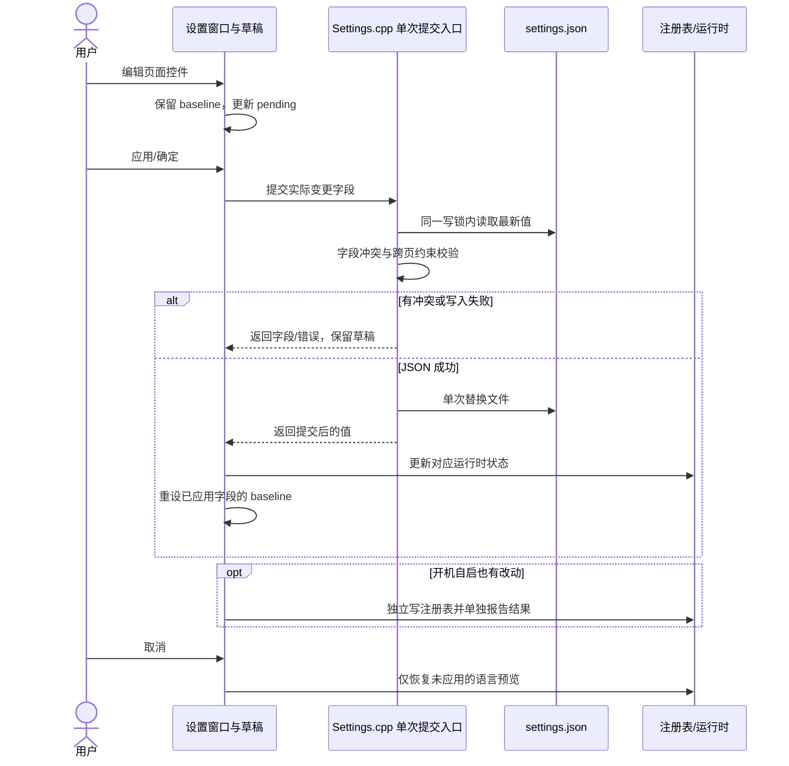
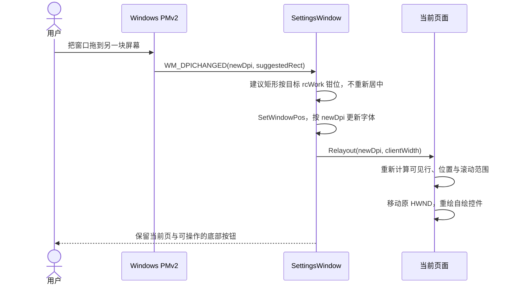

# ZenCrop 设置界面现代化重构方案

> **参考项目**：`VoxType` (`D:\GITHUB_melody0709\VoxType`)<br>
> **目标**：减少设置项增改的重复布线、改善空间与跨屏 DPI 表现；提交时只合并实际修改的字段，不覆盖设置窗口外的更新。<br>
> **前置条件（已满足）**：C++23 架构重构 P0–P6 已于 2026-09-23 全部完成并交付 v3.0.0；本方案从该交付基线之后开始，不重开架构阶段，也不以架构工序为借口延后设置 UI。<br>
> **文档位置**：`.plan/refactor/settings-ui-modernization-plan.md`

---

## 目录

1. [现状诊断与核心痛点分析](#1-现状诊断与核心痛点分析)
2. [重构目标与核心设计原则](#2-重构目标与核心设计原则)
3. [构建契约与分层架构对齐（硬门禁防线）](#3-构建契约与分层架构对齐硬门禁防线)
4. [数据流架构：字段级草稿与提交边界](#4-数据流架构字段级草稿与提交边界)
5. [Tab 结构与功能完整等价清单（6 大 Tab）](#5-tab-结构与功能完整等价清单6-大-tab)
6. [界面尺寸、工作区安全钳位与自适应栅格](#6-界面尺寸工作区安全钳位与自适应栅格)
7. [按页重排布局与控件绑定](#7-按页重排布局与控件绑定)
8. [Per-Monitor DPI v2 动态重排与无损切换](#8-per-monitor-dpi-v2-动态重排与无损切换)
9. [开发范式实态对比](#9-开发范式实态对比)
10. [施工顺序与验收门槛](#10-施工顺序与验收门槛)

---

## 1. 现状诊断与核心痛点分析

ZenCrop 当前的设置界面继承自传统的 Win32 `PropertySheetW` 属性页架构，积累了显著的技术债务与工程痛点。

### 痛点 1：多点修改地狱（单项新增改动 7~9 处）

在现有架构下，若要在某个页面增加一项简单设置（例如在截图设置中增加一个开关）：
1. 在 `src/core/ResourceIds.h` 中搜寻未占用的数值分配 `#define IDC_xxx`；
2. 在对应结构体（如 `ScreenshotSettings`）中增加字段；
3. 编辑 `src/resources.rc` 中的 `DIALOGEX` 模板，以 DLU 为单位硬编码绝对坐标；若在中间插入，必须手动逐行累加下方所有控件的 Y 坐标；
4. 在 `src/core/Strings.h` 与 `Strings.cpp` 中定义并实现多语言字符串函数；
5. 在 `src/core/Settings.cpp` 的 `Load...Settings()` 中手写 JSON 解析；
6. 在 `src/core/Settings.cpp` 的 `Save...Settings()` 中手写 JSON 组装写出；
7. 在 `src/ocr/ui/SettingsDialog.cpp` 的 `WM_INITDIALOG` 中调用 `CheckDlgButton` / `SetDlgItemText`；
8. 在 `WM_COMMAND` 中监听控件变更消息并触发 `PropSheet_Changed`；
9. 在 `WM_NOTIFY` (`PSN_APPLY`) 中提取控件状态写回结构体；
10. 在相关的联动函数（如 `UpdateXxxControls()`）中手写 `EnableWindow`。

任何一处遗漏都会引发状态不同步、保存丢失或运行时异常。

### 痛点 2：主界面物理尺寸逼仄狭小

- 现行 6 个主选项卡对话框模板宽度全部固定为 **260 DLU**（在标准 96 DPI 下仅约 390 物理像素）。
- 在现代 2K/4K 屏幕上极其局促：长路径只能露出一小段，提示词与 Token 输入框严重受挤压。
- 由于主页空间狭小，多个模块被迫拆出二级模态对话框：
  - `IDD_OCR_DOC_OPTIONS`（文档解析参数，280 DLU）
  - `IDD_OCR_PPOCRV6_OPTIONS`（PP-OCRv6 微调参数，320 DLU）
  - `IDD_SETTINGS_TRANSLATE_PROVIDERS`（翻译服务商管理，280 DLU）
  - `IDD_SETTINGS_TRANSLATE_PROMPT`（翻译提示词管理，260 DLU）
  - `IDD_OCR_MODEL_DOWNLOAD`（模型下载对话框）

### 痛点 3：自绘控件 DPI 适配缺陷

- 应用虽已声明 `PerMonitorV2`（见 `src/app.manifest:16-17`），标准 Win32 控件有系统层面的缩放兜底；
- 但**自绘与子类化控件**（如颜色预览块 `IDC_ZC_COLOR_PREVIEW`、`IDC_AOT_COLOR_PREVIEW`，以及动态创建的 `HotkeyEdit`）坐标与字体未建立统一的重排管线，跨屏拖拽（如 100% 拖至 175%）时容易出现黑边、对齐偏差或截断。

### 痛点 4：单文件承载全部六页并直连下层实现

- `src/ocr/ui/SettingsDialog.cpp`（2028 行）已在架构 P1 从 L0 迁至 **L4 `zencrop_ui`**；全仓倒置边（`moduleInversionEdges`）当时已从 59 归零，本文件不再是分层违规来源。
- 但它仍把六个 Tab、OCR 引擎/本地大模型服务与翻译页耦合在一个 TU 内，直接 include 了：
  - `translation/TranslationSettingsPage.h`（L3）
  - `OcrEngine_PaddleOCR_Local.h`（L2）
  - `LlamaServerManager.h`、`HttpTransport.h`（L1）
  - `ocr/ui/OcrModelDownloadDialog.h`（L4，同层）
- 这才是“多点修改地狱”与跨屏 DPI 缺陷的共同根源：新增或搬迁设置项必须同时改动这条 2000 行文件里的初始化、事件与保存三处逻辑。本方案要按页拆开这些责任，而不是修复一条已不存在的 L0 出边。

---

## 2. 重构目标与核心设计原则

1. **减少重复布线**：控件创建、加载、变更通知与布局集中在对应页面；新增字段仍需定义、文案、持久化和 UI 绑定，不以固定修改处数作为验收指标。
2. **精致比例、紧凑排布与按需滚动**：
   - 采用 **560×620 DIP** 作为黄金比例基准尺寸（由 860×680 收敛优化：宽度 560 DIP 让 6 个 Tab 饱满横跨 Tab 栏，消除右侧空洞；高度 620 DIP 配合截图标注页排布精简与动态滚动条隐藏 `ShowScrollBar(needScroll)`，页面仅在内容超出时显示滚动条；六页在不同 DPI 下是否均无需滚动仍待实机验收）。
   - 强制接入 **Windows 工作区安全钳位**与 **`WM_GETMINMAXINFO` 最小尺寸限制**（`520×480 DIP`），保证在各种高缩放笔记本屏幕上底部按钮绝对不被任务栏遮挡，且无法被缩小至控件塌陷。
3. **保持既有信息架构并明确快捷键行为变更**：
   - 维持原有 6 个 Tab 命名与顺序完全不变：`General`、`ZenCrop`、`Always On Top`、`OCR`、`Screenshot`、`Translate`。
   - 所有快捷键留在现有的各个 Tab 内部。
   - `ocrAlt` 新安装默认值改为 `Alt+Shift+X`；已有配置（包括显式空快捷键）不迁移、不覆盖。此项是独立的行为变更，单独测试。
4. **字段级提交而非按域整份回写**：
   - 只应用主窗口实际改动的字段；同一字段在窗口打开期间被外部修改时拒绝静默覆盖，并提供重新加载路径。详见 §4。
5. **清晰界定事务与回滚边界**：
   - 主窗口直接管理的设置项支持“取消即放弃”；
   - 子弹窗逐个标明提交边界；`settings.json`、开机自启注册表和凭据存储不是一个跨存储原子事务，不宣称全局原子性。
6. **动态重排 (Relayout) 替代销毁重建**：
   - 动态显隐（`VisibleWhen`）自动回收高度空白，彻底消除 OCR 模式切换出现的大面积空洞；
   - `WM_DPICHANGED` 触发控件重排，不销毁 HWND；焦点、选择区与 IME 组合态须实测，不把“必然无损”作为 API 保证。
7. **严守架构守卫与 CMake 门禁**：
   - 设置 UI 新增源码进入已登记的 L4 `src/ocr/ui/` 并编入既有 `zencrop_ui` 静态库；不为规避守卫而提前建通用框架或未经登记的新目录。每个施工切片都跑相关构建与测试。

---

## 3. 构建契约与分层架构对齐（硬门禁防线）

为了杜绝破坏 `build.bat` 门禁与 `scripts/check_architecture.ps1` 校验，必须遵守以下三项硬约束：

### 1. 前置条件：架构 P0–P6 已完成（不要重开、不要重跑）

根据 `.plan/refactor/00-HANDOFF.md` §0/§1 与 `.plan/refactor/rollback-anchors.md`：
- P0–P6 已于 2026-09-23 全部完成并交付 **v3.0.0**；`CMakeLists.txt` 已是 `CMAKE_CXX_STANDARD 23`，基线 `cxxStandardDeclared=23`、`moduleInversionEdges=0`、`testsCompilingProductCpp=0`。
- 本方案的设置 UI 切片从该交付基线**直接开始**，不需要（也不得）再走一遍 P0→P6；不得以“架构阶段未完成”为由推迟或改写本方案。
- 旧 `SettingsDialog.cpp` 已在 P1 行为保持地迁至 `src/ocr/ui/SettingsDialog.cpp`，该搬迁已完成；后续只替换其实现，删除它不计作本 UI 阶段的额外架构收益。
- Git 写操作（分支/提交/tag）默认仍需用户明确授权；每个切片开工前把当时的 HEAD 记入 `.plan/refactor/rollback-anchors.md`。

### 2. 源码目录与层级归属

根据 `check_architecture.ps1` 的 `LayerMap`，产品目录层级为 `'src/core' = 0 … 'src/ocr/ui' = 4; 'src' = 5`：
- **硬禁止**：切勿新增未经登记的 `src/ocr/ui/settings/` 或 `src/translation/ui/settings/` 目录，否则将直接触发 `$script:HardZeroKeys` 中的 `undeclaredSourceDirs`，导致 `ARC-NEWDIR` 立即 HARD FAIL。新页面文件直接放在已登记的 `src/ocr/ui/` 下，不新建子目录。
- 新设置宿主和按需拆出的页面实现放在 **`src/ocr/ui/`（L4）并编入既有 `zencrop_ui` 静态库**。两条依据：① `docs/01_architecture/01_ZENCROP_DEV_GUIDE.md` 明确 L4 UI = `zencrop_ui`（`src/ocr/ui/`），承载 “Dashboard, history, **settings**, and progress UI dialogs”，而 L5 只是 `src/main.cpp` 的 thin shell；② `add_executable(ZenCrop)` 受 `productTargetSourceCount` 棘轮限制（见 §3.3），新增 `.cpp` 只能进静态库。
- `zencrop_ui` 已 PUBLIC 链接 `zencrop_translate`（L3）、`zencrop_ocr`（L2）、`zencrop_platform`（L1）、`zencrop_core`（L0），旧设置文件也已 include 这些层，故不引入新的依赖类别。但必须遵守：**不得新增 L4→L5 反向 include**（会抬高 `moduleInversionEdges` 棘轮，目前为 0）；任何确实新增的跨层 include 类别都要先在守卫与 `AGENTS.md` 中登记。
- **硬禁止跨域头文件包含（ARC-FORBIDDEN）**：特别显式提醒，`ocr_ui_to_screenshot` 属于 `scripts/check_architecture.ps1` 中的 HARD 0 `ARC-FORBIDDEN` 规则。L4 设置界面的 Screenshot Tab **严禁** include `src/screenshot/` 下的任何头文件（所有截图配置数据结构均在 L0 `Settings.h` 中的 `ScreenshotSettings`，快速保存目录的选择通过 Windows 原生 COM `IFileOpenDialog` 接口实现，绝不穿透到 L3）。
- 先交付一页可用的纵向切片，再决定是否按责任拆出专用 TU；不预先建立 `ISettingsTab`、`LayoutCursor`、`SettingsFormBuilder` 等通用层。
- 每一切片都以守卫实测，不以“别处也这样”为由新增反向 include。

### 3. CMakeLists.txt 纳入与测试隔离

- `ZenCrop` 采用显式字面量源文件列表，且 `add_executable(ZenCrop ...)` **只允许 `src/main.cpp`（+ `src/resources.rc`）**：`productTargetSourceCount` 是 `ARC-RATCHET` 指标，基线为 1，P5/P6 阶段闸门也钉死为 1；往 exe 目标追加任何 `.cpp` 会同时触发 `ARC-RATCHET` FAIL 与 `-Stage P5/P6` FAIL。
- 因此新增的 `.cpp` 必须精确追加到**对应分层静态库**的源列表（本方案为 `add_library(zencrop_ui ...)`），**禁止**加入 `add_executable(ZenCrop ...)`。不要为此新建静态库：`ARC-SMOKE` 要求每个静态库都配套 `EXCLUDE_FROM_ALL` 的 `smoke_<lib>` 目标，新建库属于构建契约改动。
- 复用现有测试目标并链接已有库；不为布局小逻辑新建独立 test executable，也不把产品 `.cpp` 再列入测试源文件。架构 P3 已完成，`testsCompilingProductCpp` 为 0，不再引用旧基线 92 作为可接受状态。

---

## 4. 数据流架构：字段级草稿与提交边界

### 1. 草稿只保存基线与待编辑值

`SettingsDraft` 保存打开时的 `SharedSettings`、`OcrSettings` 基线及对应待编辑值。开机自启不在 `GeneralSettings` 内，需另存 `QueryZenCropStartupRegistration().registered` 的基线与待编辑值。语言预览另记**上一次成功应用时的实际 `S::IsChinese()` 布尔值**；不要把 `AppLanguage::Value` 直接传给只接受 `bool` 的 `S::SetLanguage`。`Auto` 的预览值按系统 UI 语言计算，不从当前预览状态反推。

```cpp
// 数据形状示意；页面只编辑其中由自己拥有的字段。
struct SettingsDraft {
    SharedSettings baseline;
    SharedSettings pending;
    OcrSettings ocrBaseline;
    OcrSettings ocrPending;
    bool startupBaseline = false;
    bool startupPending = false;
    bool appliedLanguageChinese = false;
};
```

不使用 `DIRTY_SCREENSHOT` / `DIRTY_TRANSLATION` 之类整域脏位来决定整份结构体写回。页面只枚举它实际拥有的可编辑字段，以“待编辑值 != 打开/上次应用时的基线值”生成字段补丁。取消或 Esc 丢弃尚未应用的补丁，并把语言预览恢复为上一次成功应用时的实际语言。一次成功的“应用”之后重新建立基线；“取消”不撤销已经应用的修改。

### 2. 单次文件提交与冲突检测

为主窗口新增一个**窄入口**（例如 `CommitSettingsPatch`），复用 `Settings.cpp` 现有写锁、读写及序列化逻辑，不再依次调用多个 `Save...Settings`：

1. 在同一把设置写锁内读取最新 `settings.json`；保留未识别的顶层数据及受更新版 schema 保护的翻译段。 该约束由 L0 `AssembleSettingsJson` 统一实现：六个 `Save*Settings`、`CommitSettingsPatch` 与翻译层 `SaveTranslationSettings` 共用同一装配入口。
2. 对每个待改字段比较“当前磁盘值”和草稿基线值。若当前值既不同于基线、也不同于待提交值，返回字段冲突，保持窗口打开；用户可重新加载或显式决定覆盖，**不得静默整域覆盖**。
3. 把无冲突的字段补丁应用到最新值；用合并后的当前热键与复制兜底状态做跨页校验，再序列化并**一次**原子替换配置文件，更新 `GetSharedSettings()`。没有 JSON 字段变化时不重写文件。
4. **严格保证 L0 纯度**：`CommitSettingsPatch` 在 `Settings.cpp`（L0）内仅执行三方比对合并、跨页校验（热键冲突、Ctrl+C 保全）、JSON 原子写盘及 `GetSharedSettings()` 内存更新。热键重新注册、AOT 边框状态刷新、Llama 进程启停等运行时副作用，严禁写入 L0，必须在 L0 写盘成功后由 L4 设置窗口统一调度与触发；不得执行 `GetSharedSettings() = draft.shared` 或把某一域的旧快照整份赋回。

例如 Screenshot 页只改保存格式时，补丁不会携带标注画笔字段：

```cpp
if (draft.pending.screenshot.format != draft.baseline.screenshot.format) {
    if (current.screenshot.format != draft.baseline.screenshot.format &&
        current.screenshot.format != draft.pending.screenshot.format) {
        return SettingsCommitError::Conflict;
    }
    current.screenshot.format = draft.pending.screenshot.format;
}
```



同域其他字段也可能在窗口打开期间变化：例如 Screenshot 页改保存格式，截图编辑器同时改画笔颜色；Translate 页改语言，结果窗或服务商子窗同时改 provider。故“仅保存脏域”不足以防 Lost Update。若外部写入路径不能与这个入口共享同一写锁，需要先统一锁边界或使用版本比较重试，不能声称已解决并发写入。`settings.json` 的一次替换只保证**文件级**原子性，不保证注册表或 Windows 凭据管理器的跨存储事务。

### 3. 注册表、语言和子窗口

- **开机自启**：它是独立的注册表状态，只在用户修改并点击应用时调用 `SetZenCropStartupRegistration`。与 JSON 提交分开报告成功/失败；失败时保留该项待应用状态，不显示笼统的“全部保存成功”。
- **语言**：用户改下拉框可即时预览，但只在 JSON 成功提交后更新已应用基线；提交失败或取消时恢复上一次成功应用的布尔语言状态。
- **翻译服务商与提示词子窗**：保持现有独立确认/保存边界。子窗关闭后，从已保存配置刷新外层草稿中**未被外层编辑**的子窗拥有字段及其基线；已被外层编辑的同一字段保留原基线和待编辑值，让外层应用时检测冲突。外层其他字段不动。凭据修改不承诺跟外层“取消”一起撤销。
- **翻译子窗的写入实现**：服务商列表、提示词列表与活动项按语义字段提交；现有子窗内整份 `SaveTranslationSettings(merged)` 也需迁入同一冲突/合并入口，不能只修外层主窗口。凭据写入失败后的现有恢复逻辑保留。
- **OCR 文档与 PP-OCRv6 子窗**：`IDD_OCR_DOC_OPTIONS` 与 `IDD_OCR_PPOCRV6_OPTIONS` 属于纯配置参数抽屉，应直接传入外层草稿的 `ocrPending` 引用。子窗 OK 仅将子窗中的控件状态同步更新到内存中的 `ocrPending` 并标记草稿置脏，子窗 Cancel 则丢弃子窗修改；最终由主窗口的“应用/确定”统一切入写盘与回滚。这样彻底避免破坏主窗的取消语义，并杜绝不必要的单字段伪冲突。
- **模型下载**：网络和文件 I/O 立即生效，不属于设置取消范围；下载成功后只把返回的模型路径更新到当前草稿，路径仍须由主窗应用才持久化。子窗确认、下载等独立提交边界应在按钮附近用简短状态文案告知用户。
- **子 Settings 视觉规范与统一排布**：
  1. **对话框尺寸族系（紧凑化 276 族系）**：
     - Translate Providers：`276 × 216` DLU（优化原 320×260 与 280×304 细长高耸形态，屏幕尺寸收敛至 ~420×460px）
     - Translate Prompts：`276 × 216` DLU（优化原 320×260 与 260×320）
     - Document Options：`276 × 245` DLU（优化原 320×276 与 280×346，紧凑化高收缩）
     - PP-OCRv6 Options：`276 × 195` DLU（优化原 320×218 与 320×248，紧凑无空白）
     - OCR Model Download：`310 × 195` DLU（优化原 360×220）
  2. **行高与控件高度对齐（口径修正）**：全部子对话框统一采用 Windows 原生标准对话框字体 **`FONT 9, "Segoe UI"`**；单行输入框与复选框用 **`11 DLU`**、底部按钮用 **`13 DLU`**。DLU→像素换算为 `MulDiv(dlu, baseunitY, 8)`，Segoe UI 9pt 的 `baseunitY = 16`，因此 11 DLU = **22px**（与主 Settings 的 `m_rowH = Scale(22)` 逐像素一致）、13 DLU = **26px**（与主 Settings 的 `Scale(26)` 按钮一致）。此前方案与文档写的"13 DLU = 22px"是换算疏漏，已更正。
  3. **网格与对齐网络**：参数子窗采用严格网格约束（如 PP-OCRv6 双列对称网格，左列 X=14/82，右列 X=150/200-220，数字输入框固定 46 DLU 宽；Document Options 所有下拉框统一对齐）。
  4. **Hint 文本规范**：状态文本、次级说明（如 Stored securely、Resolved: ...、Preset 说明）统一采用 **8pt Segoe UI** 字体，并在 `WM_CTLCOLORSTATIC` 中拦截着色为次级灰（`RGB(110, 110, 110)`），保证视觉层级清晰、主次分明。
  5. **统一智能锚定弹出算法（对标划词翻译，支持右/左/下/上四向自适应跟随与工作区安全钳位）**：
     - 彻底弃用各个子页面各自拷贝的散装逻辑，统一收敛至 L0 通用方法 `PositionWindowNearAnchor(HWND hwnd, HWND anchorWnd)`；
     - **根所有者精准反解**：修复此前使用 `GetAncestor(hDlg, GA_ROOTOWNER)` 跨越 `SettingsWindow` 误抓到隐藏主托盘窗口导致坐标飞向屏幕右上角（`x=1920, y=0`）的严重缺陷，精准层级解包定位到可见的 `SettingsWindow` 作为宿主锚点；
     - **PropertySheet 默认居中覆盖拦截**：针对 `PropertySheetW` 在初始化后强行自我居中覆盖主界面的行为，通过在 `PSCB_INITIALIZED` 中子类化挂接 `WM_SHOWWINDOW` 与 `WM_APP + 101/102` 双重后置消息，在尺寸确定后将窗口移向右侧，彻底终结 100% 遮挡主窗口问题；
     - **四向自适应排列管线**：对标划词翻译窗口的跟随算法，按 `Right (首选)` -> `Left (次选)` -> `Below (下选)` -> `Above (备选)` 依次探测显示器工作区空间，四向均受限时自动选拔可用空间最大的一侧；
     - **工作区绝对钳位**：严密应用 `ClampWindowCoordinate`，杜绝任何偏位、离屏或标题栏被遮挡。
  6. **动态折叠无空洞**：在 `TranslationProviderSettingsPage` 中，针对绝大多数不需要 Region 字段的服务商，通过 `AdjustProviderRegionShift` 平滑将后续控件（Reasoning、API Key、Advanced JSON、Data Destination 等）向上移动一行距离，自动填补空白洞；切换至需要 Region 的服务商时平滑恢复。

---

## 5. Tab 结构与功能完整等价清单（6 大 Tab）

维持原有 **6 个 Tab** 名称、顺序及各页快捷键归属。以下是主页面迁移核对表；`ocrAlt` 新安装默认值是唯一明确的行为变更，不能把它算进“零行为变化”。页面迁移时还需逐项对照现有 `.rc`、控件事件、数值范围与错误反馈，而不只核对字段名。

```
┌────────────────────────────────────────────────────────────────────────┐
│                              ZenCrop 设置                              │
├─ General ─┬─ ZenCrop ─┬─ Always On Top ─┬─ OCR ─┬─ Screenshot ─┬─ Translate ─┤
│           │           │                 │       │              │             │
│  (Tab 宿主内容区域随 560×620 DIP 外窗伸缩，超长内容支持纵向滚动 VScroll)                 │
│                                                                        │
├────────────────────────────────────────────────────────────────────────┤
│ [状态提示：就绪 / 保存成功]                        [ 应用 ] [ 确定 ] [ 取消 ] │
└────────────────────────────────────────────────────────────────────────┘
```

### 1. General Tab (常规)
- 界面语言：下拉框（跟随系统 / English / 简体中文）。
- 开机自启：复选框（点击应用时调用 `SetZenCropStartupRegistration`）。

### 2. ZenCrop Tab (贴图与视口)
- 裁剪边框颜色：自定义颜色选择器与色块预览。
- 边框粗细：滑块 (1~10px)。
- 贴图裁剪置顶：`cropOnTop` 复选框。
- **原有 4 个快捷键**：
  - 贴图重附着 (Reparent)：默认 `Ctrl+Alt+X`
  - 缩略图视图 (Thumbnail)：默认 `Ctrl+Alt+C`
  - 视口裁剪 (Viewport)：默认 `Ctrl+Alt+V`
  - 关闭全部贴图 (Close All)：默认 `Ctrl+Alt+Z`

### 3. Always On Top Tab (窗口置顶)
- 显示高亮边框：复选框。
- 自定义颜色：复选框 + 颜色拾取色块。
- 边框不透明度：滑块 (1%~100%)。
- 边框厚度：滑块 (1~20px)。
- 平滑圆角：复选框。
- 边框内缩：滑块 (0~20px)。
- **原有快捷键**：
  - 窗口置顶 (Always On Top)：默认 `Alt+T`

### 4. OCR Tab (文字识别 - 补齐全部等价项)
- 识别结果展示字号：数值输入框 (8~32px)。
- 结果窗口置顶：复选框。
- **引擎模式切换下拉框**（4 种模式，完全对齐）：
  1. `Local (Windows OCR)`（系统离线 OCR）
  2. `PaddleOCR Cloud`（云端服务）
  3. `PaddleOCR-VL 1.6 Local`（本地大模型服务）
  4. `PP-OCRv6 Local`（本地 ONNX 引擎）
- **Windows OCR 专属选项**（模式 1 时呈现）：
  - OCR 语言下拉框 (`IDC_OCR_LANGUAGE`：全部已安装语言、简体中文、英文、繁体中文、日语、韩语）。
- **PaddleOCR Cloud 专属选项**（模式 2 时呈现）：
  - API URL 输入框、Token 密钥框（掩码）、超时滑块、连通性测试按钮；
  - Task 下拉框 (`IDC_PADDLE_TASK`)；
  - **图表识别开关** (`IDC_PADDLE_CHART_RECOGNITION` 复选框)。
- **PaddleOCR-VL 1.6 Local 专属选项**（模式 3 时呈现）：
  - 模型根目录（文本框 + 文件夹浏览）；
  - Prompt 选项下拉框（纯文本 OCR、表格识别 Markdown、公式识别 LaTeX、图表识别、印章识别、Spotting）；
  - 服务端口（`IDC_PADDLE_LOCAL_PORT` 文本框 + 相邻 `(auto)` 提示文本，**不是复选框**；同一控件在 PP-OCRv6 模式下改标签复用为 Threads）、空闲退出超时（分钟）、服务测试按钮；
  - 文档解析总开关 +「文档高级选项...」按钮（打开既有子弹窗 `IDD_OCR_DOC_OPTIONS`）。
- **PP-OCRv6 Local 专属选项**（模式 4 时呈现）：
  - 模型根目录（文本框 + 文件夹浏览）；
  - 模型规格 Variant 下拉框（`small` / `medium`）；
  - 推理线程数 Threads 输入框；
  - 「PP-OCRv6 预设与微调...」按钮（打开既有子弹窗 `IDD_OCR_PPOCRV6_OPTIONS`）。
- **公共模型管理**：「管理/下载 OCR 模型...」按钮（呼出 `OcrModelDownloadDialog`）。
- **备用引擎路由**：备用识别路由下拉框、备用服务空闲超时。
- **原有 2 个快捷键**：
  - 区域文字识别 (OCR)：默认 `Shift+X`
  - 备用文字识别 (OCR Alt)：新安装默认 `Alt+Shift+X`。不能只改 `GetDefaultHotkeys()`：现实现是“`settings.json` 或 `hotkeys` 段不存在 → 返回整套默认值；段存在但缺 `ocrAlt` 键 → 保留默认值”，两条路径都会套用新默认。实施时必须显式区分：仅在**配置文件或 `hotkeys` 段不存在**（新安装）时套用 `Alt+Shift+X`；段存在但缺 `ocrAlt` 键时强制置空，与显式空值一样不启用。

### 5. Screenshot Tab (截图标注)
- 图像保存格式：下拉框（PNG, JPEG, BMP, WebP, AVIF）。
- JPEG 压缩质量：滑块 (1%~100%)。
- 快速保存目录：输入框 + `IFileOpenDialog` 浏览按钮。
- 辅助选项：截图包含鼠标指针、启用取色器。
- 长截图参数：启动动作下拉框、反向滚动自动裁剪。
- **原有快捷键**：
  - 屏幕截图 (Screenshot)：默认 `Shift+Alt+S`

### 6. Translate Tab (划词翻译)
- 划词翻译全局使能：对应字段 `translation.enabled`（默认 true，被 `TranslationCoordinator` 当闸门），但**当前 UI 无此控件**（`IDC_TRANSLATE_ENABLED` 是未引用残留 ID，托盘菜单也无开关）。迁移默认不新增该开关；若要新增，须作为独立行为变更登记并单独测试。
- 模拟复制兜底：Ctrl+C 保全开关。
- 默认语言对：源语言下拉框、目标语言下拉框。
- 关联 OCR 引擎路由：下拉框。
- **翻译服务商配置**：
  - 服务商下拉切换；
  - 「管理翻译服务商...」按钮（呼出既有独立子弹窗 `IDD_SETTINGS_TRANSLATE_PROVIDERS`）。
- **提示词风格**：
  - 风格预设下拉选择；
  - 「管理提示词预设...」按钮（呼出既有独立子弹窗 `IDD_SETTINGS_TRANSLATE_PROMPT`）。
- 结果窗口表现：显示原文、保留段落、结果窗口置顶、窗口边框、**原文字号**（现有字段为 `sourceFontSize`）。
- **原有快捷键**：
  - 划词翻译 (Selection Translate)：默认 `Shift+A`

---

## 6. 界面尺寸、工作区安全钳位与自适应栅格

### 1. 理想尺寸与工作区钳位

基准尺寸设定为 **`560×620 DIP`**。当前设计按单列纵向面板排布：ZenCrop 各页面均为单列纵向配置面板（控件有效右边界约 440px），560 DIP 宽度使得 6 个 Tab 标题横跨宽度（约 480px）与 Tab 栏几乎完全吻合，左侧页边距 18px、控件列自适应填满剩余宽度（`ctrlW = clientW - ctrlX - padX`，下限 240px；560 DIP 下实测约 378px），故不再有右侧大片留白；620 DIP 高度配合截图标注页排布精简（指针与取色器复选框并排、纵向间距紧凑化由 250 DLU 压至 180 DLU）以及子容器动态滚动条隐藏机制（`ShowScrollBar(SB_VERT, needScroll)`），使页面仅在内容超出时显示垂直滚动条；六页在不同 DPI 下是否均无需滚动仍待实机验收。初次打开时在目标显示器工作区居中；跨屏 `WM_DPICHANGED` 时先使用系统建议矩形，再按 `GetMonitorInfoW(...).rcWork` 钳位大小与位置，**不得每次拖拽都重新居中**。通过 `WM_GETMINMAXINFO` 锁定最小追踪尺寸为 `520×480 DIP`。

| 布局量 | 首选值（96 DPI） | 缩小时的处理 |
| :--- | :--- | :--- |
| 外窗 | 560×620 DIP | 宽高分别按目标显示器 `rcWork` 钳位，且受 520×480 最小尺寸保护 |
| 底部操作栏 | 46 DIP | 固定在客户区底部，按钮紧凑靠右排列，状态提示居左 |
| 页内左右边距 | 左 18 DIP；控件列自适应（下限 240 DIP） | 窗口变窄时控件列收缩到下限，长路径靠编辑框横向滚动 |
| 标签与表单 | 紧凑单列 / 260 DLU | 截图标注页并排精简，内容溢出时按需显示滚动条 |

窗口尺寸算法分清两个入口（首次打开 vs 跨屏 DPI）：

```text
首次打开：用 560×620 DIP 计算首选尺寸 → 限制到目标 rcWork → 居中。
跨屏 DPI：从 WM_DPICHANGED 的建议 RECT 起步 → 限制宽高 →
          把 left/top 钳进目标 rcWork；不要再次居中。
窗口手动缩放：尊重用户尺寸，受 WM_GETMINMAXINFO (520×480 DIP) 保护，只保证最小可操作客户区和可见的底部按钮。
```

窗口变矮时，仅内容区滚动；底部“应用/确定/取消”始终在客户区内，并能通过键盘抵达。窗口变窄时按实际**客户区宽度**计算行布局：足够宽用标签/控件双列，窄屏改为标签在上、控件在下，长路径/按钮组合可伸缩或换行。不能使用固定绝对 X 坐标定位行内按钮：1366px 宽屏在 200% 下可用逻辑宽度不足 700 DIP，固定坐标会直接裁掉按钮。

### 2. 尺寸验收

至少覆盖 1366×768 @ 150%/200%、1920×1080 @ 100%/150%、双屏不同 DPI、左/上任务栏与负坐标显示器。逐项确认六页无水平截断，长路径可编辑，底部按钮可见且可操作；滚动时焦点控件能自动进入可视区，窗口从一块屏拖到另一块屏不跳回中央。

### 3. 窗口与页面容器选型架构

- **层级拓扑**：顶层主窗口 (`SettingsWindow`) -> 原生标签控件 (`WC_TABCONTROL`) -> 6 个无边框子窗口容器（各 Tab 独立 HWND，窗口样式 `WS_CHILD | WS_CLIPCHILDREN | WS_VSCROLL`） -> 页面内功能控件。
- **状态与滚动隔离**：每个 Tab 拥有独立的子窗口 HWND 容器，各功能控件作为子窗口容器的子控件创建。每个 Tab 维持完全独立的纵向滚动位置（`GetScrollInfo` / `SetScrollInfo`）与独立的按页 DPI Relayout；切换 Tab 时只需 `ShowWindow(SW_SHOW)` 激活当前页容器并 `ShowWindow(SW_HIDE)` 隐藏其余 5 个容器。切换迅速、零闪烁，且杜绝了跨页滚动位置串扰与焦点污染。

---

### 7. 按页重排布局与统一控件规范 (SettingsPageLayout)

为解决各个页面快捷键大小不一、行高间距杂乱、Translate 页溢出滚动以及新增行/新增 Tab 繁琐的问题，系统落地了统一的 **`SettingsPageLayout`** 流式表单排版引擎：

### 1. 统一设计尺度 (Design Tokens)
- **基准 DPI 坐标**：基于 96 DPI，全局统一使用 `Scale(val) = MulDiv(val, dpi, 96)`。
- **外边距与列对齐**：左边距 `padX = 18px`，顶边距 `padY = 18px`，标签列宽 `labelW = 110px`，控件起始列 `ctrlX = padX + labelW + 8 = 136px`。
- **控件列宽**：标准下拉框与单行编辑框 `ctrlW = clientW - ctrlX - padX`（下限 240px），随窗口宽度自适应，避免右侧留白与长路径/长文案被截断。
- **舒展行高与垂直节奏**：控件高度统一为 `rowH = 22px`，行间距为 `rowGap = 14px`，标准行步长 `rowStep = 36px`（22px 控件 + 14px 垂直留白）。相比旧版紧凑的 8px 间距，控件间的点击范围与视觉层次更舒展，彻底告别“紧凑拥挤”感。
- **Hint 辅助提示文本规范**：
  - **小字号**：采用专用的 `hHintFont`（8pt Segoe UI，相比主窗口 9pt 及页面 10pt 字体缩小一档），呈现更精致从属的说明文字。
  - **灰色提示色彩**：父页面子类化与 DialogProc 在 `WM_CTLCOLORSTATIC` 中拦截 Hint 控件，将其文本着色为现代标准次级灰 `RGB(110, 110, 110)` 并返回透明画刷。
  - **智能布局与紧凑关联**：通过 `AddCheckboxWithHint`，Hint 与上方复选框保持紧密（3px），且左侧缩进 20px 避开方框、与复选框文字精确对齐；控件高度充足（16px）杜绝任何文本下半部截断。
- **统一快捷键规范**：
  - 全局 9 个快捷键编辑框（ZenCrop 4个、AOT 1个、OCR 2个、Screenshot 1个、Translate 1个）统一为 `高度 22px`、宽度占满控件列（右侧留 6px + 24px 清除按钮）。
  - 清除按钮 `[ X ]` 统一为紧凑方形 `宽度 24px × 高度 22px`，与编辑框右侧保持 `6px` 间距，彻底消除旧模板中 20 DLU（~35px）巨型突兀方块。
- **统一按钮尺寸**：
  - 颜色拾取 "Choose..."：`72px × 22px`。
  - 模型/服务商管理 "Manage..."：`72px × 22px`（OCR 模型管理为 `110px × 22px`）。
  - 路径浏览 "..."：`32px × 22px`。

### 2. 声明式表单排版 API
`SettingsPageLayout` 提供声明式行添加方法，无需在 `.rc` 中做手工算术：
```cpp
// 1. 标准标签+控件行
layout.AddRow(labelId, ctrlId);
// 2. 带尾部按钮行（如 下拉框 + "Manage..." 或 路径 + "..."）
layout.AddRowWithButton(labelId, ctrlId, btnId, btnWidth);
// 3. 快捷键行（Label + HotkeyEdit + [X] ClearButton）
layout.AddHotkeyRow(labelId, editId, clearId);
// 4. 颜色行（Label + 预览块 + "Choose..."）
layout.AddColorRow(labelId, previewId, chooseBtnId);
// 5. 滑块行（Label + Trackbar + 数值标签）
layout.AddSliderRow(labelId, sliderId, valLabelId);
// 6. 单行复选框 / 双列复选框 / 复选框从属Hint
layout.AddCheckbox(checkId);
layout.AddCheckboxWithHint(checkId, hintId, hintHeight);
layout.AddCheckboxPair(check1Id, check2Id);
// 7. 完成排版并自动按需控制滚动条
layout.Finish();
```

### 3. 加行与新增 Tab 的极简范式
- **加行**：在对应 `Relayout<Page>` 函数中插入单行 `layout.AddRow(...)`、`layout.AddCheckboxWithHint(...)` 或 `layout.AddHotkeyRow(...)` 即可；引擎自动处理向下顺移和 DPI 换算，无需手动计算累加 Y 坐标或修改 `.rc` 绝对坐标。
- **新增 Tab**：
  1. `.rc` 仅需声明控件 ID 与基础样式（坐标可为任意占位符）。
  2. 实现页面的 `RelayoutNewPage`，用 `SettingsPageLayout` 依次声明各行并调用 `layout.Finish()`。
  3. 在 `RelayoutPageForTab` 中加入分发项。
  4. 引擎自动计算内容物理高度 `totalH`，并在 `totalH > clientH` 时激活垂直滚动条；各 DPI 下的六页实际滚动状态仍需实机验收。

---

## 8. Per-Monitor DPI v2 动态重排与无损切换

在 `WM_DPICHANGED` 中取新 DPI 与系统建议矩形，按目标显示器工作区钳位而不重置用户拖拽位置；更新宿主/页面字体与比例后，调用与窗口缩放、OCR 模式切换共用的页面重排逻辑。保持 HWND 存活，重绘颜色预览，处理被隐藏的焦点控件、滚动位置及输入框选择区。对 IME 正在组合输入、下拉框展开和不同缩放屏间往返做人工回归；这些状态不能仅凭“没有销毁 HWND”就宣称完全无损。



---

## 9. 开发范式实态对比

以“在截图设置中添加一个【截图后自动压缩】复选框”为例：

### 现行方式（9~10 处手工修改）
必须修改 IDC 宏定义、结构体字段、`resources.rc` 坐标、`Strings.h/.cpp` 文本、`Settings.cpp`（Load / Save 两处）、`SettingsDialog.cpp`（初始化、事件监听、保存读取三处）。

### 重构后（减少 UI 手工布线，但不虚报固定修改处数）
1. **数据结构**（`src/core/Settings.h`）：`bool autoCompress = false;`
2. **多语言文案**（`src/core/Strings.h` / `.cpp`）：添加 `S::AutoCompress()`
3. **JSON 加载**（`src/core/Settings.cpp`）：`s.autoCompress = ...`
4. **JSON 保存**（`src/core/Settings.cpp`）：`j["autoCompress"] = ...`
5. **所属页面**：增加控件加载与字段变更处理，并把 `autoCompress` 纳入本页字段补丁及冲突检查。若后续确实抽取了 §7 的表单绑定，页面声明可收敛到类似下面的形式：

   ```cpp
   AddCheckbox(IDC_SS_AUTO_COMPRESS, S::AutoCompress(),
       &ScreenshotSettings::autoCompress);
   ```

目标是无需重排 `.rc` 中后续控件的绝对 Y 坐标；字段持久化和提交逻辑仍必须修改并测试，不以“添加一行 UI 声明”代替完整实现。

---

## 10. 施工顺序与验收门槛

| 阶段 | 核心交付 | 阶段退出判据 |
| :--- | :--- | :--- |
| 架构前置 | 已完成：P0–P6 交付 v3.0.0，旧 UI 已随 P1 迁入 `src/ocr/ui/` | 无需重跑；直接进入 UI-A |
| UI-A 保存语义 | 字段补丁、单次 JSON 写入、冲突/失败反馈 | 同域异字段不丢更新，同字段冲突不静默覆盖 |
| UI-B 宿主试点 | 新窗口 + General 页 + 工作区钳位 | 语言/开机自启与 DPI/取消路径可用，旧窗口可对照 |
| UI-C 简单页面 | ZenCrop、AOT、Screenshot 与快捷键 | 页面字段、热键、色块、滚动与 DPI 回归通过 |
| UI-D OCR | 四种引擎与高级子窗、模型下载联动 | 子窗独立提交、主窗草稿、服务生命周期与默认键回归通过 |
| UI-E Translate | 主页面与既有管理子窗 | provider/prompt/凭据及外层并发编辑回归通过 |
| UI-F 切换清理 | 默认入口切换、移除旧页与模板 | 六页验收矩阵、构建、相关测试和架构守卫全绿 |

原方案的 **19–25 天**可保留为最早的 UI 草估参考，但它未包含字段级冲突提交与子窗写入改造；架构 P0–P6 已完成、不计入本方案工期。UI-A 完成后按实际改造量重新估算，不把该数字当作施工承诺。

### 0. 架构前置（已完成，不是本方案 UI Phase 0）

P0–P6 已于 2026-09-23 交付 v3.0.0（见 `.plan/refactor/00-HANDOFF.md` 与 `rollback-anchors.md`），无需重跑，也不得以此推迟本方案。旧 L0 设置 UI 已随 P1 行为保持地迁至 `src/ocr/ui/SettingsDialog.cpp`。设置 UI 现代化的工期不与架构阶段混算；原“19–25 天”只作为未经新风险校准的草估。

### 1. UI-A：保存语义先行

列出六页所有可编辑字段、外部写入者、子窗拥有字段和运行时副作用；在现有测试目标中补最小冲突回归。实现 §4 的字段补丁入口、一次 JSON 写入、失败反馈及成功后的字段级运行时更新。验收用例至少包括：Screenshot 改格式期间外部改画笔颜色、Translate 改语言期间外部改 provider、同一字段冲突、翻译新版 schema 拒写、文件写失败、空补丁不写盘。此阶段不换 UI，也不新增独立测试可执行文件。

### 2. UI-B：一页可用的宿主切片

新增 L4 `zencrop_ui` 设置窗口与 General 页，保留旧 PropertySheet 作为开发期对照。验证语言预览/取消/应用、开机自启注册失败反馈、首开居中与跨屏不跳位。新窗口在六页功能齐全前不得成为默认入口；开发开关如 `ZENCROP_NEW_SETTINGS=1` 仅用于人工比对，最终发布切换前移除双实现或明确限期。

### 3. UI-C：其余简单页面

迁移 ZenCrop、AOT、Screenshot 与分散在这些页的快捷键。每迁一页就检查字段补丁、键盘焦点、滚动、颜色预览及 DPI；以页面实际重复为依据抽取小布局辅助函数。`HotkeyEdit` 的 PropertySheet 假设要在此阶段解除，旧界面在对照期仍须可工作。

### 4. UI-D：OCR 页面与独立子窗

迁移四种引擎模式、语言、云端图表识别、本地与 PP-OCRv6 参数、备用路由和快捷键。把两个 OCR 子窗从旧 `SettingsDialog.cpp` 迁出改造为纯参数抽屉，直接操作主草稿 `ocrPending`，子窗 OK 只更新内存并置脏、Cancel 丢弃；最终由主窗“应用/确定”统一写盘与回滚；模式切换回收隐藏行空白。单独验证新安装、旧配置缺 `ocrAlt`、显式禁用三种快捷键情况；同时验证 Llama 服务状态只在成功提交后变化。

### 5. UI-E：Translate 页面与独立管理窗

迁移主页面，保留服务商/提示词管理的独立保存边界；管理窗返回时刷新其拥有字段，不覆盖外层尚未提交的其他修改。覆盖凭据写入失败及恢复、主窗取消、外层字段冲突、热键与 Ctrl+C 约束。旧 `TranslationSettingsPage.cpp` 中管理窗入口在删除旧页前迁到合适的现有 owner，不因删文件而断调用。

### 6. UI-F：切换与清理

六页功能及 §6 的显示器矩阵、键盘/IME、Apply/OK/Cancel、子窗独立提交、配置失败回归全部通过后再切默认入口。确认 `tests/test_translation_contract.cpp` 等旧 `SettingsHotkeyDraft.h` 使用者已迁移，随后删除不再引用的旧页、头文件及对应 `.rc` 模板；只下调实际下降的架构基线。运行 `cmd.exe /d /c build.bat`、直接相关既有测试、守卫与 `git diff --check`；发布打包/升级矩阵只在正式发布验收时执行。

本方案不修改 `AGENTS.md`：仍使用已登记的 L4 `zencrop_ui` 与既有 C++23、守卫和构建契约。只有实施中确实改变稳定架构契约（例如新增源码目录、层级或构建门禁规则）时，才同步更新 `AGENTS.md`、开发指南与守卫。
