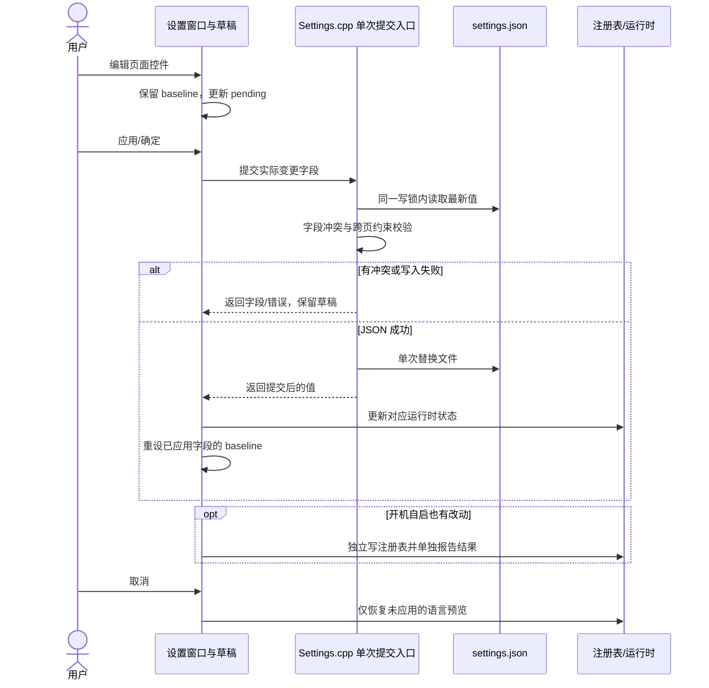
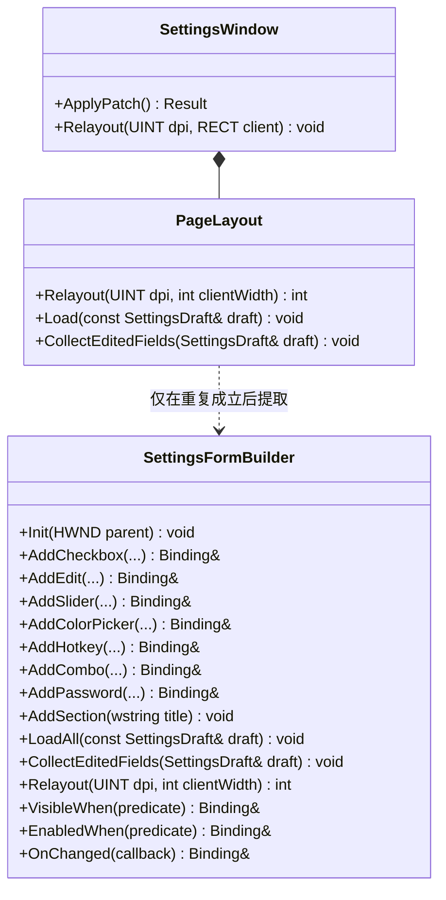
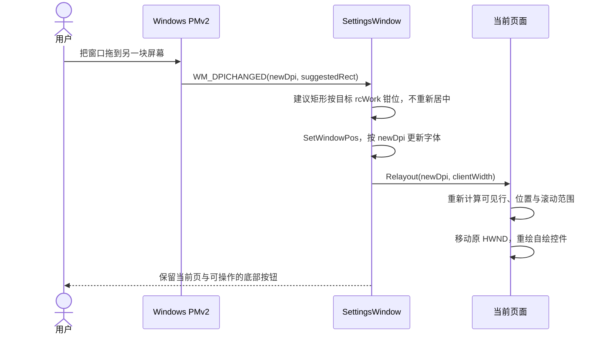

# ZenCrop 设置界面现代化重构方案

> **参考项目**：`VoxType` (`D:\GITHUB_melody0709\VoxType`)  
> **目标**：减少设置项增改的重复布线、改善空间与跨屏 DPI 表现；提交时只合并实际修改的字段，不覆盖设置窗口外的更新。  
> **前置条件**：遵守既定 C++23 架构重构 P0–P6 顺序；设置 UI 施工不借用或跳过其阶段闸门。  
> **文档位置**：`.plan/refactor/settings-ui-modernization-plan.md`  

---

## 目录

1. [现状诊断与核心痛点分析](#1-现状诊断与核心痛点分析)
2. [重构目标与核心设计原则](#2-重构目标与核心设计原则)
3. [构建契约与分层架构对齐（硬门禁防线）](#3-构建契约与分层架构对齐硬门禁防线)
4. [数据流架构：字段级草稿与提交边界](#4-数据流架构字段级草稿与提交边界)
5. [Tab 结构与功能完整等价清单（6 大 Tab）](#5-tab-结构与功能完整等价清单6-大-tab)
6. [界面尺寸、工作区安全钳位与自适应栅格](#6-界面尺寸工作区安全钳位与自适应栅格)
7. [按页重排布局与控件绑定](#7-按页重排布局与控件绑定)
8. [Per-Monitor DPI v2 动态重排与无损切换](#8-per-monitor-dpi-v2-动态重排与无损切换)
9. [开发范式实态对比](#9-开发范式实态对比)
10. [施工顺序与验收门槛](#10-施工顺序与验收门槛)

---

## 1. 现状诊断与核心痛点分析

ZenCrop 当前的设置界面继承自传统的 Win32 `PropertySheetW` 属性页架构，积累了显著的技术债务与工程痛点。

### 痛点 1：多点修改地狱（单项新增改动 7~9 处）

在现有架构下，若要在某个页面增加一项简单设置（例如在截图设置中增加一个开关）：
1. 在 `src/core/Settings.h` 中搜寻未占用的数值分配 `#define IDC_xxx`；
2. 在对应结构体（如 `ScreenshotSettings`）中增加字段；
3. 编辑 `src/resources.rc` 中的 `DIALOGEX` 模板，以 DLU 为单位硬编码绝对坐标；若在中间插入，必须手动逐行累加下方所有控件的 Y 坐标；
4. 在 `src/core/Strings.h` 与 `Strings.cpp` 中定义并实现多语言字符串函数；
5. 在 `src/core/Settings.cpp` 的 `Load...Settings()` 中手写 JSON 解析；
6. 在 `src/core/Settings.cpp` 的 `Save...Settings()` 中手写 JSON 组装写出；
7. 在 `src/core/SettingsDialog.cpp` 的 `WM_INITDIALOG` 中调用 `CheckDlgButton` / `SetDlgItemText`；
8. 在 `WM_COMMAND` 中监听控件变更消息并触发 `PropSheet_Changed`；
9. 在 `WM_NOTIFY` (`PSN_APPLY`) 中提取控件状态写回结构体；
10. 在相关的联动函数（如 `UpdateXxxControls()`）中手写 `EnableWindow`。

任何一处遗漏都会引发状态不同步、保存丢失或运行时异常。

### 痛点 2：主界面物理尺寸逼仄狭小

- 现行 6 个主选项卡对话框模板宽度全部固定为 **260 DLU**（在标准 96 DPI 下仅约 390 物理像素）。
- 在现代 2K/4K 屏幕上极其局促：长路径只能露出一小段，提示词与 Token 输入框严重受挤压。
- 由于主页空间狭小，多个模块被迫拆出二级模态对话框：
  - `IDD_OCR_DOC_OPTIONS`（文档解析参数，280 DLU）
  - `IDD_OCR_PPOCRV6_OPTIONS`（PP-OCRv6 微调参数，320 DLU）
  - `IDD_SETTINGS_TRANSLATE_PROVIDERS`（翻译服务商管理，280 DLU）
  - `IDD_SETTINGS_TRANSLATE_PROMPT`（翻译提示词管理，260 DLU）
  - `IDD_OCR_MODEL_DOWNLOAD`（模型下载对话框）

### 痛点 3：自绘控件 DPI 适配缺陷

- 应用虽已声明 `PerMonitorV2`（见 `src/app.manifest:16-17`），标准 Win32 控件有系统层面的缩放兜底；
- 但**自绘与子类化控件**（如颜色预览块 `IDC_ZC_COLOR_PREVIEW`、`IDC_AOT_COLOR_PREVIEW`，以及动态创建的 `HotkeyEdit`）坐标与字体未建立统一的重排管线，跨屏拖拽（如 100% 拖至 175%）时容易出现黑边、对齐偏差或截断。

### 痛点 4：L0 Core 严重分层违规

- `src/core/SettingsDialog.cpp`（2025 行）被放置在 **L0 Core**。
- 但其内部直接依赖了：
  - `#include "ocr/ui/OcrModelDownloadDialog.h"` (L4)
  - `#include "translation/TranslationSettingsPage.h"` (L3)
  - `#include "OcrEngine_PaddleOCR_Local.h"` (L2)
  - `#include "LlamaServerManager.h"` (L1)
  - `#include "HttpTransport.h"` (L1)
- 违反项目《AGENTS.md》中“L0 Core 出边必须为 0”的硬约束，是当前全仓 59 条倒置边（`moduleInversionEdges`）的核心成因之一。

---

## 2. 重构目标与核心设计原则

1. **减少重复布线**：控件创建、加载、变更通知与布局集中在对应页面；新增字段仍需定义、文案、持久化和 UI 绑定，不以固定修改处数作为验收指标。
2. **现代宽屏与工作区安全**：
   - 采用 **860×680 DIP** 作为理想基准尺寸，同时强制接入 **Windows 工作区安全钳位**，保证在 1080p @ 150% 等高缩放笔记本屏幕上底部按钮绝对不被任务栏遮挡。
3. **保持既有信息架构并明确快捷键行为变更**：
   - 维持原有 6 个 Tab 命名与顺序完全不变：`General`、`ZenCrop`、`Always On Top`、`OCR`、`Screenshot`、`Translate`。
   - 所有快捷键留在现有的各个 Tab 内部。
   - `ocrAlt` 新安装默认值改为 `Alt+Shift+X`；已有配置（包括显式空快捷键）不迁移、不覆盖。此项是独立的行为变更，单独测试。
4. **字段级提交而非按域整份回写**：
   - 只应用主窗口实际改动的字段；同一字段在窗口打开期间被外部修改时拒绝静默覆盖，并提供重新加载路径。详见 §4。
5. **清晰界定事务与回滚边界**：
   - 主窗口直接管理的设置项支持“取消即放弃”；
   - 子弹窗逐个标明提交边界；`settings.json`、开机自启注册表和凭据存储不是一个跨存储原子事务，不宣称全局原子性。
6. **动态重排 (Relayout) 替代销毁重建**：
   - 动态显隐（`VisibleWhen`）自动回收高度空白，彻底消除 OCR 模式切换出现的大面积空洞；
   - `WM_DPICHANGED` 触发控件重排，不销毁 HWND；焦点、选择区与 IME 组合态须实测，不把“必然无损”作为 API 保证。
7. **严守架构守卫与 CMake 门禁**：
   - UI 宿主文件位于 L5 `src/`；不为规避守卫而提前建通用框架或未经登记的新目录。每个施工切片都跑相关构建与测试。

---

## 3. 构建契约与分层架构对齐（硬门禁防线）

为了杜绝破坏 `build.bat` 门禁与 `scripts/check_architecture.ps1` 校验，必须遵守以下三项硬约束：

### 1. 前置条件：按既定 P0–P6 顺序推进

根据 `.plan/refactor/00-HANDOFF.md` §4：
- 当前 `CMakeLists.txt` 中 `CMAKE_CXX_STANDARD` 仍为 **20**；
- 先按交接文档完成 P0（`CMAKE_CXX_STANDARD 23`、`NOMINMAX`、`zencrop_build_flags`、完整构建与 `-Stage P0`）。当前工作区尚无本轮回滚锚点；Git 写操作需用户明确授权。
- `.plan/refactor/00-HANDOFF.md` 要求后续按 P1→P6 顺序实施。本方案的设置 UI 切片在 P6 验收后开始；若要把旧 UI 从 L0 移出作为 P1 的一部分，只做**行为保持的所有权搬迁**，不在架构阶段混入新窗口和保存语义。更改这个顺序须先正式调整架构计划与闸门。

### 2. 源码目录与层级归属

根据 `check_architecture.ps1` 的 `LayerMap`：
```powershell
$script:LayerMap = @{
    'src/core' = 0; ...; 'src/ocr/ui' = 4; 'src' = 5
}
```
- **硬禁止**：切勿新增未经登记的 `src/ocr/ui/settings/` 或 `src/translation/ui/settings/` 目录，否则将直接触发 `$script:HardZeroKeys` 中的 `undeclaredSourceDirs`，导致 `ARC-NEWDIR` 规则立即 HARD FAIL。
- 新设置宿主和按需拆出的页面实现放在 **`src/` 根目录（L5 App 层）**。先交付一页可用的纵向切片，再决定是否按责任拆出专用 TU；不预先建立 `ISettingsTab`、`LayoutCursor`、`SettingsFormBuilder` 等通用层。
- L5 允许依赖下层，但这不自动证明“零新增倒置边”：每一切片都以守卫实测。旧 `SettingsDialog.cpp` 若已在架构 P1 搬迁，后续只替换其实现，不再把删除它计作 UI 阶段的额外架构收益。

### 3. CMakeLists.txt 纳入与测试隔离

- `ZenCrop` 采用显式字面量源文件列表。新增的 `.cpp` 必须精确追加到 `CMakeLists.txt` 的 `add_executable(ZenCrop ...)` 中。
- 复用现有测试目标并链接已有库；不为布局小逻辑新建独立 test executable，也不把产品 `.cpp` 再列入测试源文件。架构 P3 完成后 `testsCompilingProductCpp` 应为 0，不再引用旧基线 92 作为可接受状态。

---

## 4. 数据流架构：字段级草稿与提交边界

### 1. 草稿只保存基线与待编辑值

`SettingsDraft` 保存打开时的 `SharedSettings`、`OcrSettings` 基线及对应待编辑值。开机自启不在 `GeneralSettings` 内，需另存 `QueryZenCropStartupRegistration().registered` 的基线与待编辑值。语言预览另记**上一次成功应用时的实际 `S::IsChinese()` 布尔值**；不要把 `AppLanguage::Value` 直接传给只接受 `bool` 的 `S::SetLanguage`。`Auto` 的预览值按系统 UI 语言计算，不从当前预览状态反推。

```cpp
// 数据形状示意；页面只编辑其中由自己拥有的字段。
struct SettingsDraft {
    SharedSettings baseline;
    SharedSettings pending;
    OcrSettings ocrBaseline;
    OcrSettings ocrPending;
    bool startupBaseline = false;
    bool startupPending = false;
    bool appliedLanguageChinese = false;
};
```

不使用 `DIRTY_SCREENSHOT` / `DIRTY_TRANSLATION` 之类整域脏位来决定整份结构体写回。页面只枚举它实际拥有的可编辑字段，以“待编辑值 != 打开/上次应用时的基线值”生成字段补丁。取消或 Esc 丢弃尚未应用的补丁，并把语言预览恢复为上一次成功应用时的实际语言。一次成功的“应用”之后重新建立基线；“取消”不撤销已经应用的修改。

### 2. 单次文件提交与冲突检测

为主窗口新增一个**窄入口**（例如 `CommitSettingsPatch`），复用 `Settings.cpp` 现有写锁、读写及序列化逻辑，不再依次调用多个 `Save...Settings`：

1. 在同一把设置写锁内读取最新 `settings.json`；保留未识别的顶层数据及受更新版 schema 保护的翻译段。
2. 对每个待改字段比较“当前磁盘值”和草稿基线值。若当前值既不同于基线、也不同于待提交值，返回字段冲突，保持窗口打开；用户可重新加载或显式决定覆盖，**不得静默整域覆盖**。
3. 把无冲突的字段补丁应用到最新值；用合并后的当前热键与复制兜底状态做跨页校验，再序列化并**一次**原子替换配置文件。没有 JSON 字段变化时不重写文件。
4. 只有写入成功后，才更新受影响的运行时字段、热键注册、AOT 与 OCR 服务状态；不得执行 `GetSharedSettings() = draft.shared` 或把某一域的旧快照整份赋回。

例如 Screenshot 页只改保存格式时，补丁不会携带标注画笔字段：

```cpp
if (draft.pending.screenshot.format != draft.baseline.screenshot.format) {
    if (current.screenshot.format != draft.baseline.screenshot.format &&
        current.screenshot.format != draft.pending.screenshot.format) {
        return SettingsCommitError::Conflict;
    }
    current.screenshot.format = draft.pending.screenshot.format;
}
```



同域其他字段也可能在窗口打开期间变化：例如 Screenshot 页改保存格式，截图编辑器同时改画笔颜色；Translate 页改语言，结果窗或服务商子窗同时改 provider。故“仅保存脏域”不足以防 Lost Update。若外部写入路径不能与这个入口共享同一写锁，需要先统一锁边界或使用版本比较重试，不能声称已解决并发写入。`settings.json` 的一次替换只保证**文件级**原子性，不保证注册表或 Windows 凭据管理器的跨存储事务。

### 3. 注册表、语言和子窗口

- **开机自启**：它是独立的注册表状态，只在用户修改并点击应用时调用 `SetZenCropStartupRegistration`。与 JSON 提交分开报告成功/失败；失败时保留该项待应用状态，不显示笼统的“全部保存成功”。
- **语言**：用户改下拉框可即时预览，但只在 JSON 成功提交后更新已应用基线；提交失败或取消时恢复上一次成功应用的布尔语言状态。
- **翻译服务商与提示词子窗**：保持现有独立确认/保存边界。子窗关闭后，从已保存配置刷新外层草稿中**未被外层编辑**的子窗拥有字段及其基线；已被外层编辑的同一字段保留原基线和待编辑值，让外层应用时检测冲突。外层其他字段不动。凭据修改不承诺跟外层“取消”一起撤销。
- **翻译子窗的写入实现**：服务商列表、提示词列表与活动项按语义字段提交；现有子窗内整份 `SaveTranslationSettings(merged)` 也需迁入同一冲突/合并入口，不能只修外层主窗口。凭据写入失败后的现有恢复逻辑保留。
- **OCR 文档与 PP-OCRv6 子窗**：按本方案的独立提交意图，迁出 `SettingsDialog.cpp` 中只读写静态 `g_ocrSettings` 的回调；子窗 OK 必须通过同一字段补丁入口保存其拥有的 OCR 字段，失败则不关闭。返回主窗后只刷新未被外层编辑的子窗字段；同一字段已有外层编辑则保留原基线，待外层应用时报冲突。主窗其他 OCR 编辑不动，子窗 Cancel 不写盘。
- **模型下载**：网络和文件 I/O 立即生效，不属于设置取消范围；下载成功后只把返回的模型路径更新到当前草稿，路径仍须由主窗应用才持久化。子窗确认、下载等独立提交边界应在按钮附近用简短状态文案告知用户。

---

## 5. Tab 结构与功能完整等价清单（6 大 Tab）

维持原有 **6 个 Tab** 名称、顺序及各页快捷键归属。以下是主页面迁移核对表；`ocrAlt` 新安装默认值是唯一明确的行为变更，不能把它算进“零行为变化”。页面迁移时还需逐项对照现有 `.rc`、控件事件、数值范围与错误反馈，而不只核对字段名。

```
┌────────────────────────────────────────────────────────────────────────┐
│                              ZenCrop 设置                              │
├─ General ─┬─ ZenCrop ─┬─ Always On Top ─┬─ OCR ─┬─ Screenshot ─┬─ Translate ─┤
│           │           │                 │       │              │             │
│  (Tab 宿主内容区域 860×560 DIP，超长内容支持纵向滚动 VScroll)                 │
│                                                                        │
├────────────────────────────────────────────────────────────────────────┤
│ [状态提示：就绪 / 保存成功]                        [ 应用 ] [ 确定 ] [ 取消 ] │
└────────────────────────────────────────────────────────────────────────┘
```

### 1. General Tab (常规)
- 界面语言：下拉框（跟随系统 / English / 简体中文）。
- 开机自启：复选框（点击应用时调用 `SetZenCropStartupRegistration`）。

### 2. ZenCrop Tab (贴图与视口)
- 裁剪边框颜色：自定义颜色选择器与色块预览。
- 边框粗细：滑块 (1~10px)。
- 贴图裁剪置顶：`cropOnTop` 复选框。
- **原有 4 个快捷键**：
  - 贴图重附着 (Reparent)：默认 `Ctrl+Alt+X`
  - 缩略图视图 (Thumbnail)：默认 `Ctrl+Alt+C`
  - 视口裁剪 (Viewport)：默认 `Ctrl+Alt+V`
  - 关闭全部贴图 (Close All)：默认 `Ctrl+Alt+Z`

### 3. Always On Top Tab (窗口置顶)
- 显示高亮边框：复选框。
- 自定义颜色：复选框 + 颜色拾取色块。
- 边框不透明度：滑块 (10%~100%)。
- 边框厚度：滑块 (1~20px)。
- 平滑圆角：复选框。
- 边框内缩：滑块 (0~10px)。
- **原有快捷键**：
  - 窗口置顶 (Always On Top)：默认 `Alt+T`

### 4. OCR Tab (文字识别 - 补齐全部等价项)
- 识别结果展示字号：滑块/数值 (8~32px)。
- 结果窗口置顶：复选框。
- **引擎模式切换下拉框**（4 种模式，完全对齐）：
  1. `Local (Windows OCR)`（系统离线 OCR）
  2. `PaddleOCR Cloud`（云端服务）
  3. `PaddleOCR-VL 1.6 Local`（本地大模型服务）
  4. `PP-OCRv6 Local`（本地 ONNX 引擎）
- **Windows OCR 专属选项**（模式 1 时呈现）：
  - OCR 语言下拉框 (`IDC_OCR_LANGUAGE`：全部已安装语言、简体中文、英文、繁体中文、日语、韩语）。
- **PaddleOCR Cloud 专属选项**（模式 2 时呈现）：
  - API URL 输入框、Token 密钥框（掩码）、超时滑块、连通性测试按钮；
  - **图表识别开关** (`IDC_PADDLE_CHART_RECOGNITION` 复选框)。
- **PaddleOCR-VL 1.6 Local 专属选项**（模式 3 时呈现）：
  - 模型根目录（文本框 + 文件夹浏览）；
  - Prompt 选项下拉框（纯文本 OCR、表格识别 Markdown、公式识别 LaTeX、图表识别、印章识别、Spotting）；
  - 服务端口（指定端口/自动分配复选框）、空闲退出超时（分钟）、服务测试按钮；
  - 文档解析总开关 +「文档高级选项...」按钮（打开既有子弹窗 `IDD_OCR_DOC_OPTIONS`）。
- **PP-OCRv6 Local 专属选项**（模式 4 时呈现）：
  - 模型根目录（文本框 + 文件夹浏览）；
  - 模型规格 Variant 下拉框（`small` / `medium`）；
  - 推理线程数 Threads 输入框；
  - 「PP-OCRv6 预设与微调...」按钮（打开既有子弹窗 `IDD_OCR_PPOCRV6_OPTIONS`）。
- **公共模型管理**：「管理/下载 OCR 模型...」按钮（呼出 `OcrModelDownloadDialog`）。
- **备用引擎路由**：备用识别路由下拉框、备用服务空闲超时。
- **原有 2 个快捷键**：
  - 区域文字识别 (OCR)：默认 `Shift+X`
  - 备用文字识别 (OCR Alt)：新安装默认 `Alt+Shift+X`。不能只改 `GetDefaultHotkeys()`：当前 `LoadHotkeySettings()` 会在旧配置缺少 `ocrAlt` 键时取默认值，必须区分“新安装无配置”和“既有配置缺字段”，确保升级不擅自启用快捷键；显式空值保持为空。

### 5. Screenshot Tab (截图标注)
- 图像保存格式：下拉框（PNG, JPEG, BMP, WebP, AVIF）。
- JPEG 压缩质量：滑块 (10%~100%)。
- 快速保存目录：输入框 + `IFileOpenDialog` 浏览按钮。
- 辅助选项：截图包含鼠标指针、启用取色器。
- 长截图参数：启动动作下拉框、反向滚动自动裁剪。
- **原有快捷键**：
  - 屏幕截图 (Screenshot)：默认 `Shift+Alt+S`

### 6. Translate Tab (划词翻译)
- 划词翻译全局使能：复选框。
- 模拟复制兜底：Ctrl+C 保全开关。
- 默认语言对：源语言下拉框、目标语言下拉框。
- 关联 OCR 引擎路由：下拉框。
- **翻译服务商配置**：
  - 服务商下拉切换；
  - 「管理翻译服务商...」按钮（呼出既有独立子弹窗 `IDD_SETTINGS_TRANSLATE_PROVIDERS`）。
- **提示词风格**：
  - 风格预设下拉选择；
  - 「管理提示词预设...」按钮（呼出既有独立子弹窗 `IDD_SETTINGS_TRANSLATE_PROMPT`）。
- 结果窗口表现：显示原文、保留段落、结果窗口置顶、窗口边框、**原文字号**（现有字段为 `sourceFontSize`）。
- **原有快捷键**：
  - 划词翻译 (Selection Translate)：默认 `Shift+A`

---

## 6. 界面尺寸、工作区安全钳位与自适应栅格

### 1. 理想尺寸与工作区钳位

`860×680 DIP` 只是首选**外窗**尺寸。初次打开时可在目标显示器工作区居中；跨屏 `WM_DPICHANGED` 时先使用系统建议矩形，再按 `GetMonitorInfoW(...).rcWork` 钳位大小与位置，**不得每次拖拽都重新居中**。工作区可能有负坐标，任务栏可能在任何边；尺寸还需计入非客户区、Tab 与底部操作栏，不能只比较 680 DIP 和工作区高度。

| 布局量 | 首选值（96 DPI） | 缩小时的处理 |
| :--- | :--- | :--- |
| 外窗 | 860×680 DIP | 宽高分别按目标显示器 `rcWork` 钳位 |
| 底部操作栏 | 64 DIP | 固定在客户区底部，必要时按钮收紧间距 |
| 页内左右边距 | 24 DIP | 仍保留可读边距，不用固定绝对 X 坐标 |
| 双列标签 | 140 DIP | 文字测量不足或窗口变窄时转为上下排 |
| 单行控件 | 首选 380–540 DIP | 以客户区剩余宽度伸缩，路径框优先吃满宽度 |
| 普通行 | 约 30 DIP 高、44 DIP 步进 | 多行标签和路径/按钮组合按实际高度增加 |

窗口尺寸算法保留原方案的 `CalculateWindowBounds` 思路，但分清两个入口：

```text
首次打开：用 860×680 DIP 计算首选尺寸 → 限制到目标 rcWork → 居中。
跨屏 DPI：从 WM_DPICHANGED 的建议 RECT 起步 → 限制宽高 →
          把 left/top 钳进目标 rcWork；不要再次居中。
窗口手动缩放：尊重用户尺寸，只保证最小可操作客户区和可见的底部按钮。
```

窗口变矮时，仅内容区滚动；底部“应用/确定/取消”始终在客户区内，并能通过键盘抵达。窗口变窄时按实际**客户区宽度**计算行布局：足够宽用标签/控件双列，窄屏改为标签在上、控件在下，长路径/按钮组合可伸缩或换行。不能保留固定的 `kInlineButtonX=590 DIP`：1366px 宽屏在 200% 下可用逻辑宽度不足 700 DIP，会直接裁掉按钮。

### 2. 尺寸验收

至少覆盖 1366×768 @ 150%/200%、1920×1080 @ 100%/150%、双屏不同 DPI、左/上任务栏与负坐标显示器。逐项确认六页无水平截断，长路径可编辑，底部按钮可见且可操作；滚动时焦点控件能自动进入可视区，窗口从一块屏拖到另一块屏不跳回中央。

---

## 7. 按页重排布局与控件绑定

先在一页纵向切片中用现有 Win32 控件实现创建、加载、变更通知、字段补丁与按宽度/DPI 排版。OCR 模式变化时，页面按当前模式枚举可见行；隐藏行不占高度，统一计算行矩形与内容总高，再移动现有 HWND 并更新滚动范围。Tab 切换、窗口尺寸变化与 DPI 变化调用同一页面布局函数，避免“只在初始化时计算一次”。

原方案的声明式表单接口仍是**目标形态的候选**，不是先于页面存在的基建任务。若简单页与 OCR 页都出现重复的创建、加载、字段变更与重排代码，再抽取到 `SettingsFormBuilder`；只有确实需要时才加入 `VisibleWhen`、`EnabledWhen` 和复合谓词。



原方案解决 OCR 显隐空洞的核心计算保留：先根据当前 `OcrSettings::mode` 和其他条件过滤可见行；只给可见行累加高度；随后批量移动控件、显示/隐藏控件并更新 `WS_VSCROLL` 的范围。`VisibleWhen` 若被抽取，应只决定排版和可见性，**不能**凭控件隐藏就丢掉未提交的字段值。`EnabledWhen` 只控制可操作性，不能与可见性混用。

候选绑定写法仍可表达原方案的复合联动，例如 AOT 边框的 `showBorder && customColor` 才启用色块、OCR `mode == L"paddle_cloud"` 才显示 URL。差别是绑定必须输出**字段补丁**，而不是 `SaveAll(draft)` 后把整份域结构体写盘；这个安全约束优先于语法简洁。

原来的批量 ID 分配动机同样保留：不要在 `AddColorPicker(AllocId(), AllocId(), ...)` 的多个实参里修改同一个计数器；先显式取得两个 ID，再创建拾色按钮和预览块。可直接复用已定义的 `IDC_*`，无需为了这个问题单独引入模板分配器。

`BeginDeferWindowPos` 可用于批量移动，但不等于“原子提交且必然无闪烁”；绘制抑制、显示隐藏、滚动位置和焦点恢复以实际截图与交互验收。控件 ID 使用现有常量或顺序分配，避免在同一调用的多个参数里递增分配器。`HotkeyEdit` 当前自行调用 `PropSheet_Changed`，接入新宿主前要解除它对 PropertySheet 父窗口的假设，由页面 `EN_CHANGE` 统一处理状态变化。

只有在第二、第三页出现真实重复时，才抽取小的行布局或字段绑定辅助函数；不预先承诺 `ISettingsTab` 接口、泛型 `ControlBinding`、任意谓词引擎及完整表单 DSL。

---

## 8. Per-Monitor DPI v2 动态重排与无损切换

在 `WM_DPICHANGED` 中取新 DPI 与系统建议矩形，按目标显示器工作区钳位而不重置用户拖拽位置；更新宿主/页面字体与比例后，调用与窗口缩放、OCR 模式切换共用的页面重排逻辑。保持 HWND 存活，重绘颜色预览，处理被隐藏的焦点控件、滚动位置及输入框选择区。对 IME 正在组合输入、下拉框展开和不同缩放屏间往返做人工回归；这些状态不能仅凭“没有销毁 HWND”就宣称完全无损。



---

## 9. 开发范式实态对比

以“在截图设置中添加一个【截图后自动压缩】复选框”为例：

### 现行方式（9~10 处手工修改）
必须修改 IDC 宏定义、结构体字段、`resources.rc` 坐标、`Strings.h/.cpp` 文本、`Settings.cpp`（Load / Save 两处）、`SettingsDialog.cpp`（初始化、事件监听、保存读取三处）。

### 重构后（减少 UI 手工布线，但不虚报固定修改处数）
1. **数据结构**（`src/core/Settings.h`）：`bool autoCompress = false;`
2. **多语言文案**（`src/core/Strings.h` / `.cpp`）：添加 `S::AutoCompress()`
3. **JSON 加载**（`src/core/Settings.cpp`）：`s.autoCompress = ...`
4. **JSON 保存**（`src/core/Settings.cpp`）：`j["autoCompress"] = ...`
5. **所属页面**：增加控件加载与字段变更处理，并把 `autoCompress` 纳入本页字段补丁及冲突检查。若后续确实抽取了 §7 的表单绑定，页面声明可收敛到类似下面的形式：

   ```cpp
   AddCheckbox(IDC_SS_AUTO_COMPRESS, S::AutoCompress(),
       &ScreenshotSettings::autoCompress);
   ```

目标是无需重排 `.rc` 中后续控件的绝对 Y 坐标；字段持久化和提交逻辑仍必须修改并测试，不以“添加一行 UI 声明”代替完整实现。

---

## 10. 施工顺序与验收门槛

| 阶段 | 核心交付 | 阶段退出判据 |
| :--- | :--- | :--- |
| 架构前置 | 既定 P0–P6 完成；必要时在 P1 行为保持地搬迁旧 UI | 各阶段 `check_architecture.ps1 -Stage` 通过，产品可构建 |
| UI-A 保存语义 | 字段补丁、单次 JSON 写入、冲突/失败反馈 | 同域异字段不丢更新，同字段冲突不静默覆盖 |
| UI-B 宿主试点 | 新窗口 + General 页 + 工作区钳位 | 语言/开机自启与 DPI/取消路径可用，旧窗口可对照 |
| UI-C 简单页面 | ZenCrop、AOT、Screenshot 与快捷键 | 页面字段、热键、色块、滚动与 DPI 回归通过 |
| UI-D OCR | 四种引擎与高级子窗、模型下载联动 | 子窗独立提交、主窗草稿、服务生命周期与默认键回归通过 |
| UI-E Translate | 主页面与既有管理子窗 | provider/prompt/凭据及外层并发编辑回归通过 |
| UI-F 切换清理 | 默认入口切换、移除旧页与模板 | 六页验收矩阵、构建、相关测试和架构守卫全绿 |

原方案的 **19–25 天**可保留为最早的 UI 草估参考，但它未包含字段级冲突提交、子窗写入改造和架构 P0–P6；UI-A 完成后按实际改造量重新估算，不把该数字当作施工承诺。

### 0. 架构前置（不是本方案 UI Phase 0）

先遵守 `.plan/refactor/00-HANDOFF.md` 完成既定 P0→P6 阶段与回滚锚点。当前 `CMAKE_CXX_STANDARD` 仍为 20；P0 未闭环前不改 `src/`。P1 如需迁走 L0 的旧设置 UI，只做行为保持搬迁并运行对应闸门。设置 UI 现代化的工期不与架构阶段混算；原“19–25 天”只作为未经新风险校准的草估。

### 1. UI-A：保存语义先行

列出六页所有可编辑字段、外部写入者、子窗拥有字段和运行时副作用；在现有测试目标中补最小冲突回归。实现 §4 的字段补丁入口、一次 JSON 写入、失败反馈及成功后的字段级运行时更新。验收用例至少包括：Screenshot 改格式期间外部改画笔颜色、Translate 改语言期间外部改 provider、同一字段冲突、翻译新版 schema 拒写、文件写失败、空补丁不写盘。此阶段不换 UI，也不新增独立测试可执行文件。

### 2. UI-B：一页可用的宿主切片

新增 L5 设置窗口与 General 页，保留旧 PropertySheet 作为开发期对照。验证语言预览/取消/应用、开机自启注册失败反馈、首开居中与跨屏不跳位。新窗口在六页功能齐全前不得成为默认入口；开发开关如 `ZENCROP_NEW_SETTINGS=1` 仅用于人工比对，最终发布切换前移除双实现或明确限期。

### 3. UI-C：其余简单页面

迁移 ZenCrop、AOT、Screenshot 与分散在这些页的快捷键。每迁一页就检查字段补丁、键盘焦点、滚动、颜色预览及 DPI；以页面实际重复为依据抽取小布局辅助函数。`HotkeyEdit` 的 PropertySheet 假设要在此阶段解除，旧界面在对照期仍须可工作。

### 4. UI-D：OCR 页面与独立子窗

迁移四种引擎模式、语言、云端图表识别、本地与 PP-OCRv6 参数、备用路由和快捷键。把两个 OCR 子窗回调从旧 `SettingsDialog.cpp` 迁出，按 §4 在子窗 OK 时实际提交字段，并刷新外层基线；模式切换回收隐藏行空白。单独验证新安装、旧配置缺 `ocrAlt`、显式禁用三种快捷键情况；同时验证 Llama 服务状态只在成功提交后变化。

### 5. UI-E：Translate 页面与独立管理窗

迁移主页面，保留服务商/提示词管理的独立保存边界；管理窗返回时刷新其拥有字段，不覆盖外层尚未提交的其他修改。覆盖凭据写入失败及恢复、主窗取消、外层字段冲突、热键与 Ctrl+C 约束。旧 `TranslationSettingsPage.cpp` 中管理窗入口在删除旧页前迁到合适的现有 owner，不因删文件而断调用。

### 6. UI-F：切换与清理

六页功能及 §6 的显示器矩阵、键盘/IME、Apply/OK/Cancel、子窗独立提交、配置失败回归全部通过后再切默认入口。确认 `tests/test_translation_contract.cpp` 等旧 `SettingsHotkeyDraft.h` 使用者已迁移，随后删除不再引用的旧页、头文件及对应 `.rc` 模板；只下调实际下降的架构基线。运行 `cmd.exe /d /c build.bat`、直接相关既有测试、守卫与 `git diff --check`；发布打包/升级矩阵只在正式发布验收时执行。

本方案不修改 `AGENTS.md`：仍使用已登记的 L5 与既有 C++23、守卫和构建契约。只有实施中确实改变稳定架构契约（例如新增源码目录、层级或构建门禁规则）时，才同步更新 `AGENTS.md`、开发指南与守卫。
