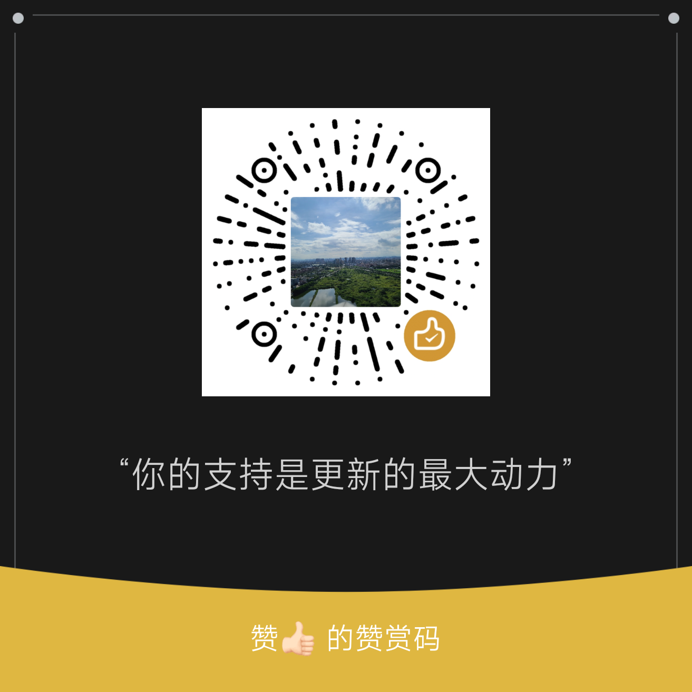

# ZenCrop v2.9.15

[中文文档](doc/README_zh.md)

An independent, **enhanced** reimplementation of [PowerToys Crop And Lock](https://github.com/microsoft/PowerToys/tree/main/src/modules/CropAndLock/), with rich screenshot annotation, long screenshot, multi-engine OCR, and OCR Dashboard.

---
## 🔥 V2.2.0 & V2.2.1 Massive Update: The Ultimate Thumbnail Mode

We've completely rewritten the **Thumbnail Mode (Ctrl+Alt+C)**, breaking through the limits of the Windows DWM API to deliver features you won't find anywhere else:

- **Strict Proportional Scaling**: Resize the cropped thumbnail freely via window edges or third-party tools like **AltSnap**. ZenCrop mathematically locks the aspect ratio so your crop never stretches and never shows black bars.
- **Engine-Defeating Invisible Rendering**: Hide the original target window from your screen and taskbar entirely! Using a groundbreaking "1-pixel anchor" hack combined with COM interface manipulation, we trick modern engines (Chromium, Electron, WinUI) into rendering at a full 60 FPS in the background without pausing. Meanwhile, **V2.2.1** brings back the ZenCrop taskbar icon for the *Thumbnail window itself*, making it effortlessly easy to manage and bring to the front when buried behind other apps.

📖 *Deep dive: [ZenCrop Thumbnail Scaling & Hiding Technology](doc/thumbnail_scaling_hiding_technology_en.md)*
---

## 🚀 Why ZenCrop over PowerToys?

While the official PowerToys module suffers from an ["all-white/black screen" known issue](https://learn.microsoft.com/en-us/windows/powertoys/crop-and-lock#known-issues) when trying to reparent modern Windows applications (UWP/WinUI/XAML apps like Calculator or Settings), **ZenCrop has completely solved this.**

ZenCrop successfully supports interactive cropping of applications that the original PowerToys Crop And Lock explicitly cannot handle, utilizing two distinct cutting-edge rendering engines:

**1. Native Viewport Cropping Technology:**
- **Windows Calculator, Settings, Microsoft To Do** (Modern UWP apps)
- Completely bypasses the "all-white screen" rendering bug by manipulating the window region instead of forcing a cross-process DWM visual tree attachment.
📖 *Deep dive: [ZenCrop Viewport Technology Implementation Report](doc/viewport_technology_report_en.md)*

**2. Deep Visual Tree Radar & Advanced Reparenting:**
- **Windows 11 Paint** (Modern `DesktopChildSiteBridge` WinUI 3 apps)
- **Magpie** and other traditional Win32 apps nesting modern XAML components (`DesktopWindowContentBridge`)
- Intelligently circumvents fragile DWM composition rules, applies smart dark-mode background camouflage to prevent washed-out colors, and utilizes inverse coordinate compensation to perfectly align the crop without triggering fallback titlebars or crashes.
📖 *Deep dive: [WinUI 3 Reparenting Technical Report](doc/WinUI3_Reparenting_Fix.md)*

## Background

PowerToys Crop And Lock is a module in the Microsoft PowerToys toolkit that allows users to crop any window into a sub-window and pin it on screen. However, the original project is deeply tied to the PowerToys framework, making it difficult to use independently or customize.

ZenCrop is rebuilt from scratch, runs completely standalone without PowerToys, and provides a lighter solution while preserving and exceeding the core functionality.

## Features

- **Smart Reparent Mode**: Crops a target window into an independent child window. ZenCrop automatically detects modern UWP/WinUI applications (like Calculator or Settings) and seamlessly falls back to a special **Viewport** mode. This prevents the "all-white" rendering bug associated with standard reparenting, ensuring all apps remain interactive.
- **Thumbnail Mode**: Displays a live DWM thumbnail of the target window with a cornflower blue border. *New in V2.2.0 & V2.2.1:* the target window is stealthily hidden from the taskbar and screen while keeping Chromium/Electron engines rendering at 60 FPS, and the thumbnail itself displays its own taskbar icon for easy window management. Supports strict proportional scaling via native window edge dragging or third-party tools like AltSnap.
📖 *Deep dive: [ZenCrop Thumbnail Scaling & Hiding Technology](doc/thumbnail_scaling_hiding_technology_en.md)*
- **Always On Top**: Press `Alt+T` to pin any window on top of all others, with a customizable border (color, opacity, thickness, rounded corners, inset)
- **Customizable Hotkeys**: All hotkeys can be customized in Settings — click the input field and press your desired key combo
- **Crop On Top**: Optionally auto-pin cropped windows on top (configurable in Settings)
- **Smart Window Detection**: The crop overlay automatically follows the mouse, dynamically highlighting the window under the cursor — crop any window on screen
- **Smart Content Detection**: High-performance MSAA smart hover detection — the overlay identifies the UI element under the cursor through the verified `IAccessible::accHitTest` hot path and cached window snapshots, using a single-rect asynchronous worker to maintain smooth animation even during fast mouse movement. Scroll the mouse wheel to move through parent/child regions; manually selected region persists while the cursor stays within it
- **Screenshot & Annotation**: Full screenshot editor with configurable toolbar (Always Show / More Tools / Always Hide, drag-to-sort), rich annotation tools (rectangle, ellipse, line, arrow, pencil, highlighter, mosaic/blur, text with outline/background, numbering, magnifier, eraser, watermark), color palette with custom picker, post-processing (rounded corners, shadow, border), and quick actions (copy, save, pin). Supports PNG/JPEG/BMP output, auto-copy, quick-save directory, and filename templates.
- **Long Screenshot**: Auto-scroll scrolling capture for web pages, documents, and chat history. Supports vertical and horizontal stitching, manual scroll mode, real-time cumulative preview, and export/copy.
- **OCR & Document Parsing**: Four OCR engines — Windows OCR (built-in WinRT), **PP-OCRv6 Local** (ONNX Runtime CPU, small/medium models), **PaddleOCR-VL 1.6 Local** (llama.cpp VLM for complex layouts, formulas, tables, charts), and PaddleOCR Cloud (official API). Dual OCR hotkeys let you assign two engines to separate shortcuts. Includes PP-DocLayout layout detection, table/formula/chart/seal recognition, header/footer/footnote control, built-in model download manager (HuggingFace/ModelScope, resume, SHA-256 verification), idle auto-exit for local VLM, optional Recursive XY-Cut physical sorting for multi-column documents, and result-on-top floating window.
- **OCR Dashboard**: Full-featured OCR workbench opened from the tray menu — persistent history with search/filter, image preview with zoom/pan and block highlighting, drag-and-drop image/folder import, PDF batch OCR with page range selection, batch queue monitoring with retry/recovery, Markdown/TXT/JSON output artifacts, WebView2 Markdown preview with KaTeX math, Mermaid diagrams, Chart.js, and HTML tables, Source/Preview toggle, and detected text/layout block overlay on source images.
- **Click to Accept**: Single-click accepts the smart suggestion; drag to manually draw a rectangle
- **Crop Area Adjustment**: After drawing the crop rectangle, you can resize it by dragging edges/corners, move it by dragging inside, and double-click to confirm — no more accidental crops
  - **Arrow Key Control**: Fine-tune the crop box with keyboard in adjust mode — Arrow keys move 1px, Ctrl+Arrow expands, Shift+Arrow shrinks, Enter confirms
  - **Coordinate Display**: Shows real-time coordinates and dimensions at the top-left corner (e.g., `1077, 864 — 320 x 240 px`)
- **Borderless / Titlebar Toggle**: Windows are borderless by default; toggle titlebar visibility via the tray menu
- **Stale Window Cleanup**: Automatically removes Reparent/Thumbnail windows whose target has been closed externally
- **System Tray**: Runs in the background; right-click the tray icon for the menu

## Hotkeys

| Hotkey | Action |
|--------|--------|
| `Ctrl+Alt+X` | Start Smart Reparent crop mode |
| `Ctrl+Alt+C` | Start Thumbnail crop mode |
| `Ctrl+Alt+V` | Force Viewport crop mode (Manual fallback) |
| `Ctrl+Alt+Z` | Close all active crop windows |
| `Alt+T` | Toggle Always On Top for the foreground window |
| `Alt+Shift+S` | Start screenshot |
| `Shift+X` | OCR with primary engine (Enter confirms → result window / history) |
| `Alt+Shift+X` | OCR with alternate engine (configurable) |
| `Shift+C` | In screenshot or OCR adjust mode: OCR selection and copy text only (toast, no result window / history). Same engine route as the session (`Shift+X` → primary, `Alt+Shift+X` → alternate). |
| `ESC` | Cancel current crop rectangle / cancel entire crop mode / close focused Thumbnail window |
| Right-click tray icon | Open menu (toggle titlebar / OCR Dashboard / settings / exit) |

> All hotkeys are customizable in Settings (right-click tray → Settings).

## Usage

1. Press `Ctrl+Alt+X` or `Ctrl+Alt+C` to enter crop mode
2. Move the mouse — a red dashed border highlights the detected UI element under the cursor (high-performance MSAA smart detection)
3. **Scroll the mouse wheel** to cycle through candidate regions (smaller → larger); the selected region persists while the cursor stays within it
4. **Click** to accept the smart suggestion and enter adjust mode, or **drag** to manually draw a crop rectangle
5. In **adjust mode**:
   - Drag edges/corners to resize
   - Drag inside the rectangle to move
   - Double-click inside the rectangle to confirm the crop
   - **Arrow keys** (↑↓←→) to move the crop box by 1px
   - **Ctrl+Arrow keys** to expand the corresponding edge by 1px
   - **Shift+Arrow keys** to shrink the corresponding edge by 1px
   - **Mouse wheel** to resize the crop box evenly
   - **Enter** to confirm (same as double-click)
   - **Shift+C** (OCR mode or screenshot): recognize text and copy to clipboard only — no OCR result dialog, no dashboard history
   - Press `ESC` to cancel the rectangle and redraw, press `ESC` again to exit
   - Click outside the rectangle to cancel and redraw
6. Press `Ctrl+Alt+Z` to close all Reparent windows
7. Press `Alt+T` to toggle Always On Top for any window
8. Press `Alt+Shift+S` to take a screenshot with annotation tools
9. Press `Shift+X` or `Alt+Shift+X` to OCR a screen region; use **Enter** for full OCR UI, or **Shift+C** for silent copy

> **Note**: The desktop background cannot be selected as a crop target. Clicking on the desktop will automatically exit crop mode.

## Settings

Right-click the tray icon → **Settings** to open the tabbed settings dialog:

- **General tab**: Startup registration, language
- **ZenCrop tab**: Overlay color & thickness, Crop On Top toggle, Reparent/Thumbnail/Close Reparent hotkey customization
- **Screenshot tab**: Output format (PNG/JPEG/BMP), JPEG quality, cursor inclusion, quick-save directory, filename template, annotation defaults (active tool, colors, pen widths, arrow style, text/font/watermark settings), toolbar layout (Always Show / More Tools / Always Hide), post-processing (rounded corners, shadow, border)
- **Always On Top tab**: Border visibility, color (system accent or custom), opacity, thickness, rounded corners, inset, AOT hotkey customization
- **OCR tab**: OCR font size, result-on-top, OCR mode (Windows OCR / PP-OCRv6 Local / PaddleOCR-VL 1.6 Local / PaddleOCR Cloud), model directory with "Manage Models..." download button (HuggingFace/ModelScope, resume, SHA-256 verify), PP-OCRv6 variant (small/medium) & threads, PaddleOCR Cloud settings (PaddleOCR-VL-1.6, API URL/token, timeout), document parsing options (layout threshold profile, chart/image/seal recognition, header/footer/footnote control), dual OCR hotkey customization

Local OCR engines require model files. Use the **Manage Models...** button in Settings → OCR to download them in-app. See [docs/03_ocr_system/00_OCR_MODEL_DOWNLOAD.md](docs/03_ocr_system/00_OCR_MODEL_DOWNLOAD.md) for manual download instructions.

## Tech Stack

- **Language**: C++20
- **Framework**: Native Windows Win32 API
- **Key Dependencies**: ONNX Runtime (PP-OCRv6 & PP-DocLayout), llama.cpp (PaddleOCR-VL via HTTP), WinHTTP (cloud API & model download), miniz (ZIP extraction), WebView2 (Markdown preview), GDI+ (image rendering)
- **System Libraries**: user32, gdi32, gdiplus, dwmapi, shcore, shell32, ole32, oleaut32, oleacc, shlwapi, comctl32, comdlg32, advapi32, winhttp, ws2_32, uxtheme, windowscodecs

## Build

### Prerequisites

- Visual Studio 2022 (with vcvars64)
- Windows SDK

### Compile

```bash
# Using build.bat (recommended)
build.bat

# Build and create MSI + portable 7z packages
build.bat --package
```

The sole runnable development output is `build/run/x64-release/ZenCrop.exe`.
`runtime-manifest.json` in the same directory records both the executable and
external-asset hashes, including asset-only incremental builds.
`build.bat` stops only that repository runtime when necessary and rejects
unknown build/runtime files before installation or packaging.

## Project Structure

```
zencrop/
├── src/
│   ├── main.cpp              # Entry point, system tray, message loop, hotkey dispatch
│   ├── app.ico               # Application icon
│   ├── resources.rc          # Dialog templates & icon resource
│   ├── app.manifest          # DPI awareness & compatibility
│   ├── core/                 # Core utilities & settings
│   │   ├── AppDataPaths.h/cpp      # %LOCALAPPDATA% path resolution
│   │   ├── ClipboardUtils.h/cpp    # Clipboard (image/text) helpers
│   │   ├── HotkeyEdit.h/cpp        # Custom hotkey input control
│   │   ├── Settings.h/cpp          # Settings persistence (JSON)
│   │   ├── SettingsDialog.h/cpp    # Tabbed settings dialog
│   │   ├── Sha256.h/cpp            # SHA-256 hashing
│   │   ├── StartupRegistration.h/cpp # Windows startup registration
│   │   └── Strings.h/cpp           # Localized strings
│   ├── detect/               # Smart detection module
│   │   ├── SmartDetector.h/cpp       # MSAA-based smart content detection
│   │   └── SmartDetectorThread.h/cpp # Background STA detector worker
│   ├── window/               # Window mode components
│   │   ├── OverlayWindow.h/cpp   # Crop area selection overlay
│   │   ├── ReparentWindow.h/cpp  # Reparent mode window
│   │   ├── ThumbnailWindow.h/cpp # Thumbnail mode window
│   │   ├── ViewportWindow.h/cpp  # Viewport mode window (for modern apps)
│   │   └── AlwaysOnTop.h/cpp     # Always On Top manager & border window
│   ├── screenshot/           # Screenshot editor & annotation
│   │   ├── ScreenshotSession.h/cpp    # Screenshot session lifecycle
│   │   ├── ScreenshotEditorWindow.h/cpp # Annotation editor window
│   │   ├── PinnedImageWindow.h/cpp    # Pinned (always-on-top) screenshot window
│   │   ├── annotation/                # Annotation data model, undo/redo history
│   │   ├── editor/                    # Toolbar model, color palette, command system
│   │   ├── longshot/                  # Long screenshot: auto-scroll, stitching, export
│   │   ├── overlay/                   # Screenshot overlay rendering & interaction
│   │   └── render/                    # Annotation geometry/content renderers
│   ├── ocr/                  # OCR module
│   │   ├── OcrUtils.h/cpp            # OCR utility functions
│   │   ├── engine/                   # OCR engine implementations
│   │   │   ├── OcrEngine.h/cpp           # OCR engine factory & interface
│   │   │   ├── OcrEngine_Local.h/cpp     # Windows OCR engine (WinRT)
│   │   │   ├── OcrEngine_PPOCRv6_ONNX.h/cpp # PP-OCRv6 Local (ONNX Runtime)
│   │   │   ├── OcrEngine_PaddleOCR_Cloud.h/cpp # PaddleOCR Cloud API
│   │   │   ├── OcrEngine_PaddleOCR_Local.h/cpp # PaddleOCR-VL 1.6 Local (llama.cpp)
│   │   │   └── OcrEngine_PaddleOCR_Doc.h/cpp   # PaddleOCR Doc (layout + VLM)
│   │   ├── layout/                   # PP-DocLayout ONNX layout detection
│   │   ├── batch/                    # Batch OCR: PDF rendering, manifests, output writers
│   │   ├── document/                 # PaddleOCR Cloud document protocol & workflow
│   │   ├── model_download/           # Built-in model downloader (WinHTTP, resume, SHA-256)
│   │   ├── ui/                       # OCR UI windows
│   │   │   ├── OcrResultWindow.h/cpp     # OCR result display window
│   │   │   ├── OcrProgressWindow.h/cpp   # OCR progress window
│   │   │   ├── OcrCopyToastWindow.h/cpp  # Copy confirmation toast
│   │   │   ├── OcrModelDownloadDialog.h/cpp # Model download dialog
│   │   │   ├── OcrDashboardWindow.h/cpp   # OCR workbench & batch dashboard
│   │   │   ├── OcrMarkdownPreviewHost.h/cpp # WebView2 Markdown preview host
│   │   │   ├── dashboard/                # Dashboard: history, batch, PDF, preview logic
│   │   │   └── webview_assets/           # WebView2 static assets (KaTeX, Mermaid, Chart.js)
│   │   └── templates/                    # PP-OCRv6 recognition dictionary (built-in)
│   ├── net/                  # Network module
│   │   ├── Network.h/cpp             # WinHTTP wrapper
│   │   ├── TcpHelper.h/cpp           # TCP helper (port allocation)
│   │   ├── LlamaServerManager.h/cpp  # llama.cpp server lifecycle manager
│   │   ├── WinHttpFileDownloader.h/cpp # Resumable file downloader
│   │   └── MiniHttpServer.h/cpp      # HTTP image server (preview cache)
│   └── image/                # Bitmap codec
│       └── BitmapCodec.h/cpp         # PNG/JPEG/BMP encoding/decoding
├── third_party/
│   └── miniz/                # miniz single-file ZIP library (model extraction)
├── build.bat             # MSVC build script
├── CMakeLists.txt        # CMake configuration
├── AGENTS.md             # AI development guide
├── README.md
└── doc/
    ├── CHANGELOG.md                   # Detailed changelog
    ├── README_zh.md                   # Chinese documentation
    ├── thumbnail_scaling_hiding_technology_en.md # Thumbnail tech deep dive (EN)
    ├── thumbnail_scaling_hiding_technology_zh.md # Thumbnail tech deep dive (CN)
    ├── viewport_technology_report.md  # Viewport mode tech report (CN)
    ├── viewport_technology_report_en.md # Viewport mode tech report (EN)
    ├── WinUI3_Reparenting_Fix.md     # WinUI 3 reparenting report (EN)
    └── WinUI3_Reparenting_Fix_zh.md  # WinUI 3 reparenting report (CN)
```

## ☕ Buy Me a Coffee

If this project is helpful to you, please consider supporting it. Your support is the driving force for my continuous updates ❤️

<table>
<tr>
<td align="center" width="33%">
<br>
<b>WeChat Pay</b>
</td>
<td align="center" width="33%">
<br>
<b>Alipay</b>
</td>
<td align="center" width="33%">
<a href="https://buymeacoffee.com/relakkes" target="_blank">

</a><br>
<b>Buy Me a Coffee</b>
</td>
</tr>
</table>

---

## License

MIT License
